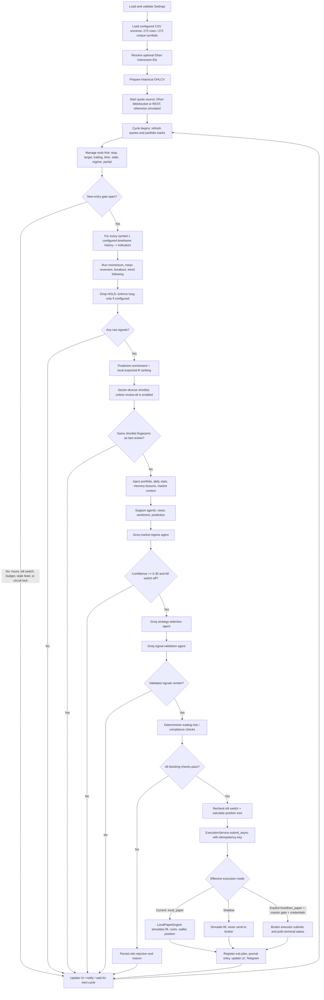

# DeltaQuant: Complete End-to-End Trading Workflow

**Code/configuration audit date:** 7 August 2026  
**Project:** `C:\Users\Dev\RakshaQuant`  
**Main runtime:** `uv run python scripts/run_live_trading.py`  
**Current dashboard:** [http://localhost:3000](http://localhost:3000)

> DeltaQuant is an educational, agent-assisted **paper-trading** system for NSE equities. It can consume real DhanHQ market data without sending real orders, or run a fully isolated simulated-data/local-paper test. Market data mode and execution mode are deliberately separate.

## Two terminology clarifications

1. **Groq, not Grok.** The current code uses Groq Cloud through `langchain_groq.ChatGroq`. The configured models are `llama-3.3-70b-versatile` (primary) and `llama-3.1-8b-instant` (fallback). There is no xAI Grok integration in this repository.
2. **Risk/compliance, not regulatory AML.** A repository-wide code search found no AML, KYC, anti-money-laundering, sanctions, or transaction-monitoring subsystem. DeltaQuant's “Risk & Compliance Agent” is a deterministic **trading- and portfolio-risk rules engine**. Broker/account AML and KYC remain outside this application's scope.

## Executive summary

The currently configured CSV contains **275 rows and 272 unique normalized symbols**. DeltaQuant loads those 272 symbols, prepares history, obtains a quote for each, calculates indicators, runs four technical strategies, and ranks only the non-HOLD signals. It then shortlists a bounded, sector-diverse set for the LangGraph agent pipeline. Groq-backed agents add context, classify the regime, choose strategies, and validate candidates; deterministic risk rules make the final approval decision. Approved trades are sized from actual capital and stop distance, submitted through a single mode-switched execution service, and—under the current setup—filled only in the local paper wallet. Every cycle manages existing exits before looking for new entries.

The current weekend setup keeps the entire broker order path disabled while allowing the workflow to run outside NSE hours:

- simulated quotes;
- explicit testing-only synthetic **daily** history;
- `FORCE_TRADING_WINDOW=true`;
- ₹1,000,000 local paper wallet;
- `TRADING_MODE=paper` and `EXECUTION_MODE=local_paper`;
- `ALLOW_LIVE_ORDERS=false`;
- all Dhan quote/history/instrument-lookup calls disabled;
- `SIGNAL_TIMEFRAMES=1d`.

This is sufficient to exercise indicator generation, ranking, the agent graph, deterministic risk, sizing, and local-paper execution on daily data. A natural trade still depends on a valid model decision and all gates passing. During this audited session, Groq's primary model hit its current token quota and the fallback response could not be parsed, so DeltaQuant correctly failed closed and did not create a fabricated trade. The local-paper fill path was verified separately by focused integration tests.

## End-to-end flow



## Normal live-data paper operation versus the current weekend test

“Live-data” below means real Dhan market data; it does **not** imply live-money execution.

| Concern | Normal live-data paper operation | Current simulated weekend test |
|---|---|---|
| Universe | Configured CSV, normalized and deduplicated; fallback is the built-in NIFTY 50 + midcap list if the CSV is unusable | Same configured CSV: 275 rows → 272 unique symbols |
| Instrument lookup | Can resolve configured symbols against Dhan's instrument master | Disabled |
| Quotes while NSE is open | Dhan WebSocket when credentials/connectivity work; Dhan REST polling is the configured fallback | Simulated quote generator only |
| Quotes outside market hours | Dhan REST last-available quotes when enabled, otherwise simulation | Simulated quote generator only |
| Historical OHLCV | Dhan history, with local caching and refresh behavior | Explicit testing-only synthetic daily history for all 272 symbols |
| Synthetic history safety | Off by default; a Dhan history failure does not silently invent production history | On only because every safe-test condition is satisfied |
| Entry schedule | IST market/trading-window gates apply | `FORCE_TRADING_WINDOW=true` bypasses the trading-hours block for testing |
| Signal timeframes | Configurable; production can use supported daily and intraday histories | `1d`, because the testing fixture seeds daily history only |
| Execution | Typically `local_paper` for this educational system, even with real market data | `local_paper` |
| Live-order master gate | Off unless someone explicitly sets `ALLOW_LIVE_ORDERS=true`; broker credentials are also required | Hard off: `ALLOW_LIVE_ORDERS=false` |
| Wallet | Persisted paper wallet configured by settings | Fresh ₹1,000,000 wallet, no open positions or trades at reset |
| AI | Same Groq-backed agent graph and deterministic fallbacks | Same graph; current Groq quota/response issue can conservatively stop entries |
| Separate alpha discovery | Uses its configured historical multi-timeframe panel | Scheduler can start, but there is no synthetic 15m/30m/1h/4h panel; zero usable symbols means no meaningful new formula evaluation |

### The synthetic-history safety latch

Synthetic history is not enabled merely by setting one flag. The runtime permits it only when all of the following are true:

- `ENABLE_SYNTHETIC_HISTORY=true`;
- `FORCE_TRADING_WINDOW=true`;
- `TRADING_MODE=paper`;
- effective execution is `local_paper`;
- `ALLOW_LIVE_ORDERS=false`;
- Dhan historical calls are disabled;
- Dhan quote calls are disabled.

This prevents testing candles from being mixed into a live or broker-routed session.

## Stage 1 — Configuration, startup, and safety posture

`src/config/settings.py` is the single configuration model. Code accesses it through cached `get_settings()`; `reload_settings()` clears that cache. Secrets are `SecretStr` values. Cross-field validation emits warnings and lets the application degrade safely instead of crashing at startup.

At startup the live runner initializes:

- logging and optional tracing;
- PostgreSQL-backed paper wallet, positions, orders, signal records, journals, daily risk state, and strategy performance;
- the execution service and its idempotency store;
- the exit manager and any persisted managed positions;
- the market-data and history managers;
- memory/learning components;
- FinOps counters and alerts;
- the advisory profit-goal plan;
- the FastAPI/WebSocket dashboard service;
- optional Telegram notifications and background discovery jobs.

Configuration can be checked without launching the loop using `uv run python scripts/check_config.py`. The main application entry point is `uv run python scripts/run_live_trading.py`.

### Startup reconciliation

Execution reconciliation depends on the **effective** mode:

- In `local_paper`, the engine loads its own persisted wallet, open positions, and order history from PostgreSQL. There is no broker position to reconcile.
- In effective `live` or `dhan_paper`, the runner creates the Dhan adapter/live executor, fetches broker positions, and reconciles local state against the broker, with the broker treated as the source of truth.
- If a requested broker mode is downgraded to `shadow` by a safety gate, no broker order is sent.

## Stage 2 — Universe loading and “discovery”

The configured universe file is `C:\Users\Dev\Documents\Delta_Trading\symbols.csv`. The loader finds a case-insensitive `symbol` column, trims and uppercases each value, removes blanks, and deduplicates while preserving order. The current file has 275 data rows and 272 unique symbols.

If that CSV is missing, unreadable, lacks a symbol column, or contains no usable symbol, `StockDiscovery` falls back to its built-in NIFTY 50 + midcap universe rather than preventing startup.

There are three different ideas that can be confused under “discovery”:

1. **Universe discovery/loading:** decides which symbols the runtime may inspect.
2. **Per-cycle signal discovery:** scans every configured symbol and timeframe for technical signals.
3. **Offline alpha-formula discovery:** an optional Groq-driven research workflow under `src/signal_discovery/`; it proposes and statistically evaluates formulas, but is isolated from execution.

The old deterministic `universe_screener.py` was removed. The current runtime does **not** run a second full-universe quote screener before technical analysis. The configured CSV is the trading universe, and local signal ranking/diversification is the only shortlist before the agent graph.

Sector-movers and scalping-candidate panels are auxiliary scanners/UI feeds, not approval shortcuts. They cannot bypass the main agent, risk, sizing, or execution gates. They are disabled in the current test setup.

## Stage 3 — Instrument resolution, history, and data quality

When Dhan instrument lookup is enabled, configured symbols are resolved against Dhan's instrument master before quote/history operations. The current weekend setup disables this network path.

`HistoryManager` prefetches history for the entire universe before meaningful indicator work begins:

- normal mode requests Dhan OHLCV and can load/save cached history;
- current test mode seeds deterministic testing-only daily OHLCV when the Dhan feed is unavailable;
- without Dhan history **and** without explicit synthetic permission, the symbol remains unavailable—production does not invent candles.

History handling includes several anti-bias and data-quality protections:

- a quote's volume is treated as the cumulative daily volume; the current bar keeps the maximum rather than summing the same cumulative number repeatedly;
- the live loop normally excludes the still-forming current-day bar so indicators do not repaint or look ahead;
- indicator outputs sanitize NaN and infinity to `None` before signal/agent serialization;
- indicator calculations are memoized by symbol, last bar, and close;
- at least roughly the indicator warm-up window (26 bars for the real-indicator path) is needed;
- quote freshness is tracked. When a configured staleness threshold is exceeded, new entries are blocked while exits continue.

### Current test limitation

The synthetic fixture creates daily candles. It does not create an intraday OHLCV panel for 15m, 30m, 1h, and 4h. That is why the main weekend runtime is configured to `SIGNAL_TIMEFRAMES=1d`. The optional automatic alpha-discovery scheduler still advertises its own intraday research timeframes; with zero usable intraday history, it cannot produce meaningful new research signals in this mock session. This limitation does not disable the main daily trading pipeline.

## Stage 4 — Quote-source selection and cycle refresh

`MarketDataManager.start()` selects a source in this order:

1. If `market_data_source=dhan`, NSE is open, credentials exist, and the WebSocket connects, subscribe to live NSE quotes.
2. If Dhan quotes are enabled but the WebSocket path is unavailable or the market is closed, use Dhan REST quote polling. A history/quote API cooldown is retried once; repeated failure raises instead of silently claiming live data.
3. Otherwise load simulated quotes and label the data source `simulated`.

The market-open decision uses IST utilities, not the host machine's local timezone. `FORCE_TRADING_WINDOW` does not turn the Dhan WebSocket into a weekend feed; it only lets the testing loop and risk rule proceed outside normal hours. In the current setup, Dhan calls are disabled and simulated quotes are explicit.

Each cycle refreshes simulated prices or reads the active live/REST feed, updates paper-position marks and unrealized P&L, builds a market-price map, refreshes the dashboard state, and then handles existing positions before considering any new trade.

## Stage 5 — Existing positions and exits run first

Exit management is intentionally ahead of new-entry work. This preserves the ability to reduce risk even when entries are paused by the clock, a data problem, an AI budget, or the kill switch.

For every managed position with a current price, `ExitManager.check_exits()` evaluates:

1. hard stop-loss;
2. take-profit target;
3. ATR-based trailing stop;
4. maximum holding-time exit;
5. stale-trade exit;
6. adverse market-regime change;
7. partial-profit rule.

If several rules trigger in one cycle, the highest-priority rule wins. The manager then moves eligible trailing stops, checks breakeven promotion, updates MAE/MFE, and persists the changed management state.

An exit order closes or reduces the local paper position. The runner records net realized P&L in the daily risk state, updates strategy performance, journals the reason and trade metrics, updates learning feedback, unregisters a fully closed position, refreshes the UI, and sends best-effort notifications. Partial exits leave the remainder managed.

## Stage 6 — New-entry pre-gates

Before spending compute on new candidates, the loop checks conditions that can safely short-circuit the cycle:

- normal market/trading hours, unless forced testing is enabled;
- daily-loss/drawdown kill switch;
- an execution circuit lock or incomplete emergency flatten;
- FinOps hard token/cost budget;
- quote staleness;
- required data/history availability.

These gates affect **new entries**. Exit monitoring remains active wherever possible.

## Stage 7 — Indicator and technical-signal generation

For each available `symbol × configured timeframe`, the runtime obtains settled history, computes real indicators, and invokes `SignalEngine` unconditionally. It does not pre-filter the universe with the removed screener.

The four built-in strategies are:

- momentum;
- mean reversion;
- breakout;
- trend following.

Each strategy can produce BUY, SELL, or HOLD. HOLD is discarded. When `LONG_ONLY=true`—as in the current setup—SELL entry candidates are discarded; SELL orders are still allowed to close existing longs.

Technical confidence is evidence-based. The engine blends the strategy's base confidence with independent directional agreement from RSI, MACD, directional indicators, and price-versus-moving-average evidence. Entry, stop, target, risk/reward, timeframe, indicator context, and strategy identity travel with each `TradingSignal`.

If no raw signal fires, the cycle logs the outcome, updates the UI, waits on a short cooldown, and tries again. No LLM call or order occurs.

## Stage 8 — Prediction enrichment, ranking, and shortlist

Before the LangGraph review, a local ranking stage avoids sending all 272 symbols to the LLMs. The prediction component is a support model, while Groq is used by the language-model agents described in the next stage.

For every raw signal, `rank_signals()` estimates a win probability from:

- technical confidence;
- directional prediction probability, when available;
- strategy/regime trade history over the lookback window;
- an optional, tightly bounded alpha-discovery tilt.

Historical performance uses Beta(2,2) smoothing:

```text
historical probability = (winning trades + 2) / (total trades + 4)
```

The blended probability is clamped to 5%–95%. The discovery tilt is hard-clamped to ±0.20 and the configured normal cap is smaller. Expected value is expressed in R-multiples:

```text
expected R = p(win) × reward/risk − (1 − p(win))
rank score = expected R + 0.10 × p(win)
```

The result is marked `cold_start`, `limited_history`, or `empirical` according to sample size. Strongest expected-R candidates sort first.

`select_diversified_signals()` then enforces:

- maximum admitted symbols;
- maximum signals per symbol;
- maximum symbols per known sector.

The current settings use `MAX_ACTIVE_STOCKS=15`, `LLM_REVIEW_MAX_SYMBOLS=5`, and `MAX_SIGNALS_PER_SYMBOL=2`. If `llm_review_all_signals` is enabled, the truncation can be skipped. An unchanged shortlist fingerprint is not re-sent to Groq every tight loop; the runner logs it and cools down.

### Isolation of offline alpha discovery

The optional `SignalDiscoveryWorkflow` asks a Groq “Signal Agent” to propose formulas over OHLCV. A “Code Agent” compiles them with an AST allowlist—no generated `exec`, imports, attributes, or arbitrary subscripts. A Rank-IC evaluator measures cross-sectional Spearman correlation with forward returns. Acceptance requires both the configured IC threshold and a Bonferroni-corrected p-value threshold across attempted formulas. Stored formulas are revalidated against current thresholds when loaded.

An accepted formula may only add a small probability tilt during **ranking**. It has exactly one consumer. It cannot change a stop, position size, or deterministic risk decision.

## Stage 9 — State assembly and memory context

The shortlisted candidates are converted into the shared `TradingState`. It includes market data, indicators, raw signals, portfolio/wallet information, daily statistics, precomputed predictions, relevant memory lessons, and graph bookkeeping.

When learning is enabled, the memory store retrieves the most relevant prior lessons using context and time-decayed relevance. These lessons inform prompts; they do not bypass hard rules. PostgreSQL is the primary store. If agent-memory PostgreSQL initialization fails, that subsystem falls back to in-memory SQLite, meaning learning still works for the process but is lost on restart.

## Stage 10 — The LangGraph AI/agent pipeline

The graph is a fixed `StateGraph`:

```text
START
  → support_agents
  → market_regime
  → strategy_selection (conditional)
  → signal_validation (conditional)
  → risk_compliance
  → END
```

Each node returns a partial state dictionary that LangGraph merges into the shared state.

### 10.1 Support agents

The support stage runs news, sentiment, and prediction enrichment. The canonical state contracts matter: news sentiment is a dictionary, market mood is a full sentiment object, headlines are structured records, and prediction signals are lists of structured predictions. Type guards prevent malformed enrichment from breaking downstream nodes.

Support-agent errors are caught and logged. Missing news, mood, or prediction context degrades the decision but does not crash the graph.

### 10.2 Market-regime agent

The Groq-backed regime node classifies conditions such as `trending_up`, `trending_down`, `ranging`, or `volatile`, with a confidence and rationale. It receives technical context plus available news/sentiment/prediction context.

The graph ends immediately when:

- regime confidence is below 0.30; or
- the kill switch is active.

### 10.3 Strategy-selection agent

If regime routing permits, a Groq-backed strategy agent chooses suitable strategies for the detected regime and explains its selection.

### 10.4 Signal-validation agent

The Groq-backed validation node evaluates candidate quality and adds validation confidence/reasons. If no signal survives, the graph ends before risk or execution.

### 10.5 LLM resilience and fail-closed behavior

Every LLM node follows the same resilience pattern:

- acquire the shared Groq rate limiter;
- execute through the Groq circuit breaker;
- try the primary model;
- use the configured fallback model on rate-limit failures;
- strip Markdown JSON fences, parse, clamp, and validate the response;
- return a deterministic fallback result on any unhandled model, circuit, rate-limit, or parse failure;
- record tokens/cost after successful model responses.

The graph itself therefore does not crash because an LLM failed. In the live runner, a degraded/fallback core decision is additionally treated conservatively: new order placement is suppressed rather than turning uncertain AI output into a trade.

In the current session, the primary Groq model reported a token-quota error and the fallback response was invalid/empty JSON. That is an external AI availability limit, not a market-data or local-execution failure. DeltaQuant stopped before order creation, as designed.

## Stage 11 — Deterministic trading-risk and compliance gate

Despite its agent name, `risk_compliance_node` is ordinary deterministic Python, not an LLM. It evaluates every validated signal and separates rejected candidates, warnings, and approved trades.

Only failed checks with severity `block` reject a signal. Failed warnings are retained for visibility but do not by themselves veto it.

| Rule | Severity | What it protects |
|---|---|---|
| Daily trade count | Block | Prevents exceeding the configured number of entries per day; current limit is 5 |
| Daily realized loss | Block | Prevents new entries after the configured loss ceiling; current limit is ₹10,000 |
| Candidate position percentage | Block | Rejects a candidate above the configured per-position cap |
| Risk/reward | Warning | Flags reward/risk below the configured minimum |
| Stop distance | Warning | Flags a stop wider than the configured percentage |
| Maximum open positions | Block | Prevents opening beyond the concurrent-position cap |
| IST trading window | Block | Prevents out-of-window entries unless `FORCE_TRADING_WINDOW=true` |
| Drawdown | Block | Prevents new entries after the configured drawdown ceiling |
| Duplicate symbol | Warning | Flags adding to a symbol already held |
| Combined technical/validation confidence | Warning | Flags average confidence below 0.50 |
| Sector exposure | Warning | Flags concentrated market value in the candidate's sector |
| Same-sector position count | Warning | Flags too many correlated positions in one sector |
| Pairwise return correlation | Warning | Flags candidate/history correlation above the configured threshold when enough overlapping returns exist |

Pairwise correlations are computed upstream from settled daily closes for current positions and candidates. Insufficient history produces no correlation observation rather than a fabricated value.

### Kill switch

`check_kill_switch()` reacts to daily-loss or drawdown breaches. It is enforced twice:

1. while routing the graph after regime classification; and
2. immediately before approved entries are submitted.

If the system needs to flatten, it makes bounded passes to close tracked positions, logs/alerts any incomplete flatten, and keeps the execution circuit locked. Exit/flatten work is not disabled just because entries are blocked.

## Stage 12 — Position sizing

Risk approval does not mean “buy a fixed percentage.” The runtime sizes each approved entry using `calculate_position_size()` and the actual paper-wallet capital, entry, stop, target, configured `risk_per_trade`, and maximum-position percentage. When available, it also supplies ATR and a historical strategy win rate.

`PositionSizer.calculate_optimal()` prioritizes:

1. Kelly criterion when target and a win rate above 30% are available;
2. volatility-adjusted sizing when current and average volatility are available;
3. ATR-based sizing when ATR is available;
4. fixed-fractional sizing from the stop distance as the fallback.

All methods remain capped by maximum position/risk constraints. The runner converts the result to whole shares. Invalid sizing inputs degrade to a minimal safe quantity only after the surrounding risk and affordability checks; they do not authorize a broker path.

The advisory monthly profit-goal engine never feeds sizing. It estimates required pace, win rate, and frequency within the configured limits. If a target requires more risk, it marks the goal infeasible and recommends lowering the target—not relaxing safeguards.

## Stage 13 — Unified order submission and mode resolution

Every entry goes through `ExecutionService.submit_async()` with:

- symbol, side, quantity, price, and order type;
- a persistent idempotency key/client order ID;
- the kill-switch callback;
- the configured and effective execution modes.

Duplicate idempotency keys return `DUPLICATE` instead of creating a second order, including across restarts when the key is already persisted.

### Execution-mode safety matrix

| Requested mode | Additional conditions | Effective behavior |
|---|---|---|
| `local_paper` | None beyond normal risk/entry gates | Fill through the local virtual wallet; no broker call |
| `shadow` | None | Simulate through the paper engine and label it shadow; no broker call |
| `live` or `dhan_paper` | `ALLOW_LIVE_ORDERS=false` | Loud warning and effective `shadow`; no broker call |
| `live` or `dhan_paper` | Master gate on but Dhan credentials absent | Loud error and effective `shadow`; no broker call |
| `live` or `dhan_paper` | Master gate on, credentials present, broker executor attached | Submit through Dhan and poll order status to a terminal filled/partial/rejected result |

There is no silent downgrade from a requested broker mode to ordinary local paper. A blocked broker route becomes clearly labelled shadow simulation.

The current mode is the simplest safe branch: `local_paper` plus `ALLOW_LIVE_ORDERS=false`. The broker submit method is unreachable from the current effective mode.

## Stage 14 — Local paper order, fill, and accounting

For a local market order, `ExecutionService` calls `LocalPaperEngine.place_order()`. The engine applies an auditable `CostModel`:

- adverse slippage;
- brokerage;
- STT and other NSE-style charges;
- GST and configured fees.

The fill therefore differs from an idealized zero-cost backtest unless `CostModel.zero()` is explicitly supplied in a test.

The engine handles:

- opening long or short positions when permitted;
- adding to a position;
- opposite-side FIFO closing/covering;
- partial closes;
- a reversal only for the quantity remaining after the old position is closed;
- realized P&L net of charges from both legs;
- committed capital for both longs and shorts;
- insufficient-balance rejection or partial fill;
- long-only protection against overselling a long to create a short.

Market orders fill immediately at the simulated cost-adjusted price. A non-market/limit order is recorded as pending; the local engine does not pretend it was immediately filled.

Wallet, position, and order changes are committed to PostgreSQL. Database failures log and roll back rather than writing half a trade. After a filled entry, the runner registers the stop/target and management metadata in `ExitManager`, records active memory lessons, journals the trade, updates daily counters/UI, and sends best-effort notifications.

Focused tests verified both the direct local-paper fill and async `submit_async()` paper path. A separate safety test verified that a nominal live request without opt-in resolves to shadow. No artificial order was injected into the user's real demo wallet during the audit.

## Stage 15 — Monitoring, P&L, take-profit, and stop-loss lifecycle

On later cycles, fresh/simulated prices mark every open position. The wallet exposes cash, committed capital, market value, total equity, unrealized P&L, realized P&L, trade count, and win rate to the runner and UI.

The exit lifecycle is:

1. update current/highest/lowest prices and MAE/MFE;
2. test hard stop and target;
3. test/advance trailing stop using ATR;
4. promote eligible stops to breakeven;
5. test time, stale-trade, and adverse-regime exits;
6. test partial-profit threshold;
7. select the highest-priority triggered rule;
8. place the close/reduce order;
9. book net P&L and charges;
10. update daily risk, strategy performance, journal, memory feedback, UI, and notifications.

If a quote is missing for a position, that symbol is skipped for that pass rather than exited on an invented price. The position remains tracked for the next valid quote.

## Stage 16 — Journaling, performance, and learning

DeltaQuant has separate operational records:

- **SignalLogger:** generated signals, validation rejection, risk rejection, long-only/degraded outcomes, and approvals.
- **TradeJournal:** entries, exits, exit reasons, holding details, MAE/MFE, fees, and net P&L.
- **Daily risk state:** trade count, realized P&L, and drawdown used by hard gates.
- **PerformanceTracker:** strategy/regime trade history and empirical win rates used by future ranking and sizing.
- **Agent memory:** lessons inferred from closed losing trades and feedback on lessons active at entry.

When a position fully closes and learning is enabled, the runner builds a `TradeOutcome`, classifies the mistake/lesson, stores it, and marks the lessons that influenced the entry as successful or unsuccessful. Classification can use the model but is failure-isolated: learning must never interrupt execution or exit handling.

Performance history is PostgreSQL-backed and survives restarts when the database is available. Journaling and learning errors are logged and isolated from the trading loop.

## Stage 17 — Dashboard, API, WebSocket, and notifications

The backend exposes FastAPI state and health endpoints, including:

- `GET /api/state` — complete current dashboard state;
- `GET /api/signals` — signal view;
- `GET /api/health` — service/dependency health;
- WebSocket updates — pushes state changes to connected dashboards.

The Next.js frontend at [http://localhost:3000](http://localhost:3000) shows the current mode, data source, market/testing gate, connection state, account KPIs, open positions, activity log, active strategies, agent activity, AI decision, session cost, sector movers, scalping candidates, signal/trade history, and system status. The Equity Curve was removed from the current overview. The UI is observational; it does not bypass backend controls.

Telegram notifications are best-effort for startup/shutdown, trade events, risk/goal conditions, and operational alerts. A Telegram failure is logged without stopping the loop. Optional Langfuse tracing is handled similarly; its absence can mark health as degraded while the core paper system remains operational.

## Stage 18 — FinOps and operational controls

Each successful LLM response records model, agent, tokens, and paid-tier-equivalent cost. Counters roll over by IST day. Configured soft-budget thresholds alert once per key/day; the hard budget stops further LLM/new-entry work while exits continue.

Groq calls are also protected by a shared token-bucket rate limiter and circuit breaker. This prevents a failing provider from creating a rapid retry storm. Cycle-level exceptions are caught, logged, surfaced in the activity log, and followed by backoff rather than terminating the entire process.

## Important failure and safety branches

| Condition | Runtime behavior | Can a new order occur? |
|---|---|---|
| Market closed, normal mode | Entry cycle pauses; exits/monitoring remain available | No |
| Market closed, explicit forced test mode | Trading-hours rule reports bypassed and test cycle may continue | Only local paper under the current safe latch |
| Dhan WebSocket unavailable | Use configured Dhan REST quotes or explicit simulation | Depends on all later gates |
| Dhan REST quotes fail after cooldown | Raise/report source failure rather than calling it live | No from that failed cycle |
| History missing/too short | Skip indicator/signal for affected symbol/timeframe | No for that candidate |
| Dhan history unavailable in production | Do not fabricate synthetic history by default | No meaningful signal without other valid history |
| Synthetic flag set without all safe-test conditions | Testing history permission is denied | No synthetic-data order path |
| Stale quote | Block new entry; keep exit handling | No new entry |
| No technical signal | Log and cool down | No |
| Long-only receives SELL candidate | Discard as a new entry | No short entry |
| Duplicate shortlist fingerprint | Avoid redundant Groq review; cool down | No duplicate review/order |
| Groq rate/quota failure | Try fallback; use deterministic fallback on failure | Runner conservatively suppresses degraded core entry |
| Support agent fails | Continue without that optional context | Possible, if core agents and hard gates pass |
| Regime confidence < 0.30 | Graph ends | No |
| No validated signal | Graph ends | No |
| Risk warning fails | Record warning | Possible if every block passes |
| Risk block fails | Reject and persist reason | No |
| Daily loss/drawdown kill switch | Stop new entries; recheck at execution; flatten/lock when required | No new entry |
| FinOps hard budget | Skip agent/new-entry work | No; exits continue |
| Repeated idempotency key | Return duplicate result | No second order |
| Paper balance insufficient | Reject or partially fill according to engine accounting | Not beyond affordable quantity |
| Requested broker mode, master gate off | Resolve to labelled shadow simulation | No broker order |
| Requested broker mode, credentials missing | Resolve to labelled shadow simulation | No broker order |
| Broker order merely “placed” | Poll terminal broker status; do not assume filled | Position only after confirmed result |
| Database write fails | Roll back and log | No half-committed local trade |
| Journal/learning/Telegram/Langfuse fails | Isolate and continue core safety work | Does not itself authorize an order |
| Emergency flatten incomplete | Keep tracking, lock circuit, emit critical alert | No new entry |

## Persistence and sources of truth

| State | Primary persistence/source of truth | Failure behavior |
|---|---|---|
| Settings | `.env` through Pydantic settings | Warnings and safe degradation |
| Universe | Configured CSV; built-in fallback | Bad CSV falls back rather than stopping startup |
| Paper wallet/positions/orders | PostgreSQL paper tables | Rollback on write failure |
| Idempotency keys | Persistent idempotency store | Prevents restart replay |
| Exit-management state | Persisted exit-manager records | Reloaded for tracked positions |
| Signal/trade journals | PostgreSQL records | Failure-isolated logging |
| Daily risk | Persistent per-IST-day state | Drives trade/loss/drawdown gates |
| Strategy performance | PostgreSQL | Used by ranking/sizing when available |
| Agent memory | PostgreSQL, in-memory SQLite fallback | Fallback loses lessons on restart |
| Broker positions in effective live mode | Broker | Broker wins reconciliation |
| Dashboard state | In-process state + REST/WebSocket | Rebuilt/pushed from backend state |

## Current weekend-test evidence

The following was observed or verified during the current test session without enabling a live order path:

- 272/272 unique configured symbols loaded;
- 272/272 synthetic daily histories prepared;
- dashboard reported `PAPER`, `SIMULATED`, and forced `TRADING` test mode;
- paper account showed ₹10,00,000 starting equity;
- cycles ran outside market hours and generated/ranked daily technical signals;
- LLM calls reached Groq, but the current quota/invalid fallback response caused conservative no-trade behavior;
- backend health and dashboard connectivity were available; optional Langfuse was the only degraded dependency observed;
- local-paper market fills and async submission passed focused tests;
- a live request without opt-in passed the shadow-safety test;
- the user wallet remained clean at ₹1,000,000 with zero positions/trades after verification.

This proves the safe simulated execution branch is reachable. It does **not** claim that a natural agent-approved order occurred in this session; the AI gate correctly prevented one under degraded Groq output.

## Switching back to live market data safely

To leave weekend simulation, the operator should restore normal market scheduling and real Dhan data intentionally:

1. turn off forced trading (`FORCE_TRADING_WINDOW=false`);
2. turn off synthetic history (`ENABLE_SYNTHETIC_HISTORY=false`);
3. re-enable only the required Dhan lookup/history/quote switches;
4. restore the intended supported signal timeframes;
5. keep `TRADING_MODE=paper`, `EXECUTION_MODE=local_paper`, and `ALLOW_LIVE_ORDERS=false` unless there is a separately reviewed, explicit decision to test a broker path.

Real Dhan data and local-paper execution are fully compatible. There is no need to enable live-money orders to test decisions against live prices.

## Code map used for this audit

- Configuration: `src/config/settings.py`, `.env`, `.env.example`
- Main orchestration: `scripts/run_live_trading.py`
- Universe: `src/market/stock_discovery.py`
- Quote routing/simulation: `src/market/manager.py`, `src/market/simulated_data.py`, `src/market/dhan_quotes_feed.py`, `src/market/websocket_feed.py`
- History/indicators/signals: `src/market/history_manager.py`, `src/market/indicators.py`, `src/market/signals.py`
- Ranking: `src/market/signal_ranking.py`
- Agent graph/state: `src/agents/graph.py`, `src/agents/state.py`
- AI agents: `src/agents/market_regime.py`, `src/agents/strategy_selection.py`, `src/agents/signal_validation.py`, `src/agents/news_analyst.py`, `src/agents/sentiment.py`, `src/agents/prediction.py`
- Risk and kill switch: `src/agents/risk_compliance.py`
- Sizing: `src/market/sizing.py`
- Execution: `src/execution/service.py`, `src/execution/paper_engine.py`, `src/execution/live_executor.py`, `src/execution/adapter.py`, `src/execution/costs.py`
- Exits/journals: `src/execution/exit_manager.py`, `src/execution/journal.py`, `src/execution/signal_log.py`
- Memory/performance: `src/memory/`
- Offline alpha discovery: `src/signal_discovery/`
- FinOps/profit plan: `src/finops/`, `src/profit/goal_engine.py`
- API/UI: `src/api/`, `web/`
- Focused safety verification: `tests/test_execution_service.py`, `tests/test_live_lifecycle.py`, `tests/test_runtime_fixes.py`

---

**Bottom line:** The current weekend configuration exercises the real DeltaQuant orchestration and local-paper accounting with simulated quotes and explicit synthetic daily history, while making the real broker order path unreachable. Its conservative no-trade result during the audit came from the AI provider gate, not from a broken mock-data or paper-execution path.
