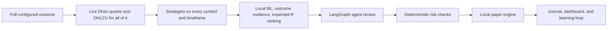

# DeltaQuant

[](LICENSE)
[](pyproject.toml)
[](web/package.json)
[](#safety-defaults)

**An agentic, paper-trading research workflow for the Indian NSE market.** A
LangGraph pipeline of LLM-backed agents (Groq) classifies market regime,
selects strategies, validates signals, and hands final approval to a
deterministic risk engine — running against real DhanHQ market data with
local, simulated execution.

DeltaQuant is built for research and paper validation. It is **not**
investment advice, it does not promise returns, and live order routing is
disabled by default (see [Safety Defaults](#safety-defaults)).

---

## Table of Contents

- [How It Works](#how-it-works)
- [Safety Defaults](#safety-defaults)
- [Prerequisites](#prerequisites)
- [Quick Start](#quick-start)
- [Universe and Review Controls](#universe-and-review-controls)
- [Agent Team](#agent-team)
- [Quantitative Signal Discovery](#quantitative-signal-discovery)
- [Data and Execution Model](#data-and-execution-model)
- [Dashboard and Audit Trail](#dashboard-and-audit-trail)
- [Project Structure](#project-structure)
- [Configuration Notes](#configuration-notes)
- [Testing and Quality](#testing-and-quality)
- [Documentation](#documentation)
- [Security](#security)
- [License](#license)

---

## How It Works




Each stage has a distinct responsibility:

1. **Universe load.** At startup, the full `STOCK_UNIVERSE_CSV_PATH` universe
   (or the built-in NIFTY50+midcap list if unset) is loaded as-is — no
   pre-filtering. Dhan security IDs are resolved and historical OHLCV is
   pre-fetched for every symbol.
2. **Strategy scan.** Every cycle, each available symbol receives
   deterministic strategy analysis on `SIGNAL_TIMEFRAMES`. Forming candles are
   excluded by default to avoid intra-bar repainting.
3. **Local ranking.** A local scikit-learn direction model scores only
   symbol/timeframe pairs where a strategy fired. Technical confidence,
   sample-smoothed closed-trade outcomes, and risk/reward combine into an
   estimated win probability and expected R.
4. **Shortlisting.** Ranked symbols are capped per sector and truncated to
   `MAX_ACTIVE_STOCKS`. Only the top `LLM_REVIEW_MAX_SYMBOLS` receive news
   enrichment and LLM agent review.
5. **Agent review.** A failed or degraded LLM review is analysis-only — it can
   never create a paper or broker position (fail-closed).
6. **Final authority.** The deterministic risk engine and the long-only paper
   engine have the last word regardless of what the agents recommend.

## Safety Defaults

The checked-in `.env.example` is deliberately conservative:

| Setting | Default | Meaning |
| --- | --- | --- |
| `TRADING_MODE` | `paper` | No live-trading mode by default. |
| `EXECUTION_MODE` | `local_paper` | Orders are simulated locally. |
| `ALLOW_LIVE_ORDERS` | `false` | Real Dhan order submission is disabled. |
| `LONG_ONLY` | `true` | Buys open holdings; sells only close owned holdings. |
| `MARKET_DATA_SOURCE` | `dhan` | Quotes and historical candles come from DhanHQ. |
| `ENABLE_DHAN_HISTORICAL_DATA` | `true` | Indicators use Dhan OHLCV only. |
| Synthetic history | disabled | A symbol without Dhan history is skipped, never fabricated. |
| Agent fallback | fail closed | Degraded LLM review cannot open a new position. |

`local_paper` uses real Dhan prices but keeps the wallet, fills, fees, and
positions in a local, durable paper ledger. It never calls the broker order
endpoint. Enabling `live` execution requires clearing three independent gates
(`trading_mode=live`, `allow_live_orders=true`, and valid Dhan credentials) —
see [Configuration Notes](#configuration-notes).

## Prerequisites

| Requirement | Version | Used for |
| --- | --- | --- |
| [Python](https://www.python.org/) | 3.11+ | Backend agent pipeline and trading loop |
| [uv](https://github.com/astral-sh/uv) | latest | Python dependency management |
| [Node.js](https://nodejs.org/) | 18+ | Web dashboard (optional) |
| [PostgreSQL](https://www.postgresql.org/) | any recent | Agent memory, signal history, paper ledger |
| [DhanHQ](https://dhan.co/) account | — | Live market data (quotes + historical OHLCV) |
| [Groq](https://groq.com/) API key | — | LLM agent reasoning (free tier is sufficient) |

Without a Dhan account, the live loop automatically falls back to simulated
data instead of failing — useful for evaluating the system end to end before
wiring up a broker.

## Quick Start

### 1. Install dependencies

```bash
uv sync --extra dev --extra web
cp .env.example .env
```

> Windows (PowerShell): `Copy-Item .env.example .env`

Configure the required values in `.env`:

- `GROQ_API_KEY`
- `DHAN_CLIENT_ID` plus either `DHAN_ACCESS_TOKEN` or PIN/TOTP credentials
- `DATABASE_URL`
- `STOCK_UNIVERSE_CSV_PATH` pointing to a CSV with a `symbol` column

Keep these safeguards in place while evaluating the system:

```dotenv
TRADING_MODE=paper
EXECUTION_MODE=local_paper
ALLOW_LIVE_ORDERS=false
LONG_ONLY=true
MARKET_DATA_SOURCE=dhan
ENABLE_DHAN_HISTORICAL_DATA=true
ENABLE_DHAN_QUOTES=true
```

### 2. Validate configuration

```bash
uv run python scripts/check_config.py
```

### 3. Start the paper trading workflow

```bash
uv run --extra web python scripts/run_live_trading.py
```

The backend dashboard API is served at `http://127.0.0.1:8010` once
`ENABLE_WEB_UI=true` is set in `.env`.

### 4. Start the web dashboard (optional)

```bash
cd web
npm install
cp .env.local.example .env.local   # set NEXT_PUBLIC_WS_URL if the backend isn't local
npm run dev
```

Open `http://localhost:3000`.

## Universe and Review Controls

The full configured CSV receives local strategy analysis. The controls below
limit the ranked shortlist and LLM workload — not signal-generation coverage.

| Setting | Purpose | Typical value |
| --- | --- | --- |
| `LLM_REVIEW_ALL_SIGNALS` | Send every generated strategy signal to the agent graph, bypassing shortlist caps. | `false` |
| `MAX_ACTIVE_STOCKS` | Maximum sector-diverse symbols kept after local ranking. | `15` |
| `LLM_REVIEW_MAX_SYMBOLS` | Maximum ranked symbols sent to the agent graph. | `5` |
| `UNIVERSE_MAX_PER_SECTOR` | Maximum shortlisted names from one sector. | `2` |
| `MAX_SIGNALS_PER_SYMBOL` | Maximum high-confidence signals per reviewed name. | `2` |
| `TRADING_CYCLE_SECONDS` | Interval between full agent review cycles. | `120` |
| `SIGNAL_TIMEFRAMES` | Comma-separated Dhan timeframes. | `15m,30m,1h,4h` |

Sending hundreds of raw quote records to an LLM on every cycle is slow and
expensive. Local strategies and ML cover the full universe; Groq reviews only
the strongest evidence. Set `LLM_REVIEW_ALL_SIGNALS=true` to send every
generated signal instead — the daily FinOps budget still gates new LLM cycles
regardless.

## Agent Team

| Component | Role | Execution type |
| --- | --- | --- |
| News Analyst | Summarizes Google News RSS sentiment. | LLM-assisted |
| Sentiment Agent | Builds a market mood index. | Deterministic/hybrid |
| Prediction Agent | Produces short-horizon ML direction estimates. | scikit-learn |
| Market Regime | Classifies the reviewed market context. | Groq LLM |
| Strategy Selection | Selects compatible strategies. | Groq LLM |
| Signal Validation | Filters raw technical signals. | Groq LLM |
| Risk and Compliance | Enforces position, loss, exposure, and time rules. | Deterministic |

The agents review candidates; they do not replace data quality, portfolio
construction, or risk controls. `risk_compliance` is a rules engine, not an
LLM, and has final say on every entry.

## Quantitative Signal Discovery

An NVIDIA-style quantitative-signal-discovery workflow (Signal / Code / Eval
agents) is adapted to the existing Groq, Dhan, FinOps, and paper-trading
stack. With `SIGNAL_DISCOVERY_AUTO_RUN=true`, it researches the full
configured universe on `15m`, `30m`, `1h`, and `4h` automatically every 24
hours. This schedule is separate from the 120-second trading cycle, so
formula generation never delays quotes, exits, or deterministic strategy
scanning. An on-demand run is also available:

```bash
uv run python scripts/discover_signals.py "volume-adjusted momentum"
```

The **Signal Agent** proposes formulas from a fixed operator allowlist. A
deterministic local **Code Agent** compiles them as a restricted AST walk
(never `exec`/`eval`), and the **Eval Agent** computes cross-sectional
Spearman Rank-IC against forward returns. Failed formulas receive Groq
optimization feedback and retry. Only candidates clearing both
`abs(IC) >= SIGNAL_DISCOVERY_IC_THRESHOLD` and a **Bonferroni-corrected**
p-value bar are persisted under `data/discovered_signals/<timeframe>/`.

When `SIGNAL_DISCOVERY_ENABLED=true`, accepted artifacts are re-validated at
load, evaluated on the live cross-sectional Dhan panel, sign-inverted when IC
is negative, standardized, and applied as a small, bounded probability tilt to
a strategy signal on the matching timeframe — never to position sizing or risk
gates. Discovery never submits an order.

## Data and Execution Model

- **Quotes.** `MarketDataManager` tracks the full configured universe directly
  from startup (no pre-narrowing scan) — live via WebSocket where subscription
  coverage exists, REST polling otherwise. `MAX_ACTIVE_STOCKS` only bounds the
  post-ML ranked shortlist, not what gets quoted or strategy-scanned.
- **History.** `DhanHistoricalFeed` obtains Dhan candles, paginated past
  Dhan's 90-day API window. Daily OHLCV is constructed from Dhan 60-minute
  data because the daily endpoint can reject otherwise-valid requests. History
  is cached locally for reuse.
- **No fabricated data.** Symbols without sufficient real OHLCV are excluded
  from review for that cycle; a real/simulated data source is never silently
  substituted mid-position (see `entry_data_source` lineage tracking).
- **Paper fills.** `LocalPaperEngine` applies configurable slippage and
  NSE-style charges, persists the wallet and positions to PostgreSQL, and
  keeps a complete order ledger.
- **Exits.** `ExitManager` handles stop, target, trailing, partial, time, and
  regime exits for existing positions.

## Dashboard and Audit Trail

The backend exposes state, signal history, paper trades, and health data over
a WebSocket + REST API. The web UI shows open positions, closed paper trades,
market status, sector movers, scalping candidates, and a full signal-pipeline
audit trail — including *why* a candidate was rejected at each stage.

The following records are durable in PostgreSQL:

- Paper orders and reconstructed closed-trade history
- Trade journal entries and net realized P&L
- Signal history with validation and risk-rejection reasons
- Daily risk state, performance statistics, and learning-loop outcomes

A reduced cash balance is not by itself a loss — it can represent capital held
in an open paper position. Use total portfolio value and trade history
together when reconciling the account.

## Project Structure

```
DeltaQuant/
├── scripts/                 # Entry points (run_live_trading.py, check_config.py, ...)
├── src/
│   ├── agents/               # LangGraph nodes: regime, strategy, validation, risk
│   ├── api/                  # Health checks
│   ├── backtesting/          # Backtest engine + walk-forward validation
│   ├── config/                # Centralized pydantic-settings configuration
│   ├── dashboard/             # Terminal (rich) dashboard
│   ├── db/                    # SQLAlchemy models and migrations
│   ├── execution/              # Paper engine, live broker adapter, exit manager
│   ├── finops/                 # LLM cost tracking and budget alerts
│   ├── market/                 # Quotes, history, indicators, signal ranking
│   ├── memory/                 # Learn-from-losses feedback loop
│   ├── notifications/          # Telegram alerts
│   ├── profit/                  # Risk-bounded profit-goal planner
│   ├── signal_discovery/        # Quantitative signal-discovery workflow
│   ├── utils/                    # Rate limiter, circuit breaker, market time (IST)
│   └── webui/                    # FastAPI backend for the web dashboard
├── web/                      # Next.js dashboard frontend
├── tests/                    # pytest suite
├── docs/                     # Architecture and design documentation
└── .env.example              # Full, documented configuration reference
```

## Configuration Notes

- Langfuse tracing is optional observability only. Set
  `LANGFUSE_TRACING_ENABLED=true` after configuring both Langfuse API keys —
  it never gates Dhan, Groq, or paper execution, and it never affects trading
  decisions.
- Groq rate limits or malformed agent responses are visible in logs. The
  system retains prior analysis but blocks new entries until a healthy review
  completes.
- `dhan_paper` and `live` execution modes are separate from `local_paper`.
  `dhan_paper` always resolves to a simulated fill (no verified Dhan sandbox
  exists) and can never reach a live route. Do not enable `live` orders
  without independently validating the full workflow in paper mode first.
- Signal discovery is an experimental research process, not evidence of
  future profitability. Paper validation remains required after Rank-IC
  acceptance.

## Testing and Quality

```bash
uv sync --extra dev --extra web

uv run --extra dev pytest -q                # full test suite
uv run --extra dev pytest --cov=src         # with coverage
uv run --extra dev ruff check .             # lint
uv run --extra dev ruff format .            # format
uv run --extra dev mypy src                 # type-check (strict mode)
```

## Documentation

| Document | Contents |
| --- | --- |
| [Introduction](docs/1_Introduction.md) | Project goals and scope |
| [High-Level Design](docs/2_High_Level_Design.md) | System architecture overview |
| [Low-Level Design](docs/3_Low_Level_Design.md) | Module- and function-level detail |
| [System Design Decisions](docs/4_System_Design.md) | Key trade-offs and rationale |
| [Component Reference](docs/5_Components.md) | Per-component reference |

## Security

- Never commit `.env` — it is gitignored, and `.env.example` is the tracked
  reference for required variables.
- All secrets (`GROQ_API_KEY`, `DHAN_ACCESS_TOKEN`, `DATABASE_URL`, etc.) are
  loaded via `pydantic-settings` `SecretStr` fields, never logged in plain
  text.
- Report a vulnerability by opening a private security advisory on this
  repository rather than a public issue.

## License

Released under the [MIT License](LICENSE). This project is educational and
for paper-trading research only — it is not investment advice, and past
strategy performance (paper or backtested) does not guarantee future results.
