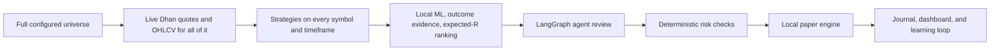

# DeltaQuant

DeltaQuant is a long-only NSE trading workflow that uses real DhanHQ market
data and local paper execution. It generates multi-timeframe strategy signals
for the full configured universe, ranks them locally, then sends only a small,
diversified shortlist to the LangGraph agent team for review.

It is designed for paper validation first. It is not investment advice and it
does not promise returns.

## What Runs




The stages have different responsibilities:

1. At startup, the full `STOCK_UNIVERSE_CSV_PATH` universe (or the built-in
   NIFTY50+midcap list if unset) is loaded as-is — no pre-filtering. Dhan
   security IDs are resolved and historical OHLCV is pre-fetched for every
   symbol in it.
2. Every cycle, each available symbol receives deterministic strategy analysis
   on `SIGNAL_TIMEFRAMES`. Forming candles are excluded by default.
3. The local sklearn direction model scores only symbol/timeframe pairs where a
   strategy fired. Technical confidence, sample-smoothed closed-trade outcomes,
   and risk/reward are combined into estimated probability and expected R.
4. Ranked symbols are capped per sector and truncated to `MAX_ACTIVE_STOCKS`.
   Only the first `LLM_REVIEW_MAX_SYMBOLS` receive news and agent review.
5. A failed or fallback LLM review is analysis-only. It cannot create a paper
   or broker position.
6. The risk engine and the long-only paper engine remain the final authority.

## Safety Defaults

The checked-in example configuration is deliberately conservative:

| Setting | Default | Meaning |
| --- | --- | --- |
| `TRADING_MODE` | `paper` | No live-trading mode by default. |
| `EXECUTION_MODE` | `local_paper` | Orders are simulated locally. |
| `ALLOW_LIVE_ORDERS` | `false` | Real Dhan order submission is disabled. |
| `LONG_ONLY` | `true` | Buys open holdings; sells only close owned holdings. |
| `MARKET_DATA_SOURCE` | `dhan` | Quotes and historical candles come from DhanHQ. |
| `ENABLE_DHAN_HISTORICAL_DATA` | `true` | Indicators use Dhan OHLCV only. |
| Synthetic history | disabled | A symbol without Dhan history is skipped, never fabricated. |
| Agent fallback | fail closed | Degraded LLM review cannot open a new position. |

`local_paper` uses real Dhan prices but keeps the wallet, fills, fees, and
positions in the local durable paper ledger. It does not call the broker order
endpoint.

## Quick Start

### 1. Install dependencies

```powershell
uv sync --extra dev --extra web
Copy-Item .env.example .env
```

Configure the required values in `.env`:

- `GROQ_API_KEY`
- `DHAN_CLIENT_ID` plus either `DHAN_ACCESS_TOKEN` or PIN/TOTP credentials
- `DATABASE_URL`
- `STOCK_UNIVERSE_CSV_PATH` pointing to a CSV with a `symbol` column

Keep these safeguards in place while evaluating the system:

```dotenv
TRADING_MODE=paper
EXECUTION_MODE=local_paper
ALLOW_LIVE_ORDERS=false
LONG_ONLY=true
MARKET_DATA_SOURCE=dhan
ENABLE_DHAN_HISTORICAL_DATA=true
ENABLE_DHAN_QUOTES=true
```

### 2. Start the paper workflow

```powershell
uv run --extra web python scripts/run_live_trading.py
```

The backend dashboard is served at `http://127.0.0.1:8010` when
`ENABLE_WEB_UI=true`.

### 3. Start the optional web frontend

```powershell
Set-Location web
npm install
npm run dev
```

Open `http://localhost:3000`. The frontend expects the backend WebSocket URL
from `web/.env.local`.

## Universe And Review Controls

The full configured CSV receives local strategy analysis. The controls below
limit the ranked shortlist and LLM workload, not signal-generation coverage.

| Setting | Purpose | Typical value |
| --- | --- | --- |
| `LLM_REVIEW_ALL_SIGNALS` | Send every generated strategy signal to the agent graph, bypassing shortlist caps. | `false` |
| `MAX_ACTIVE_STOCKS` | Maximum sector-diverse symbols kept after local ranking. | `15` |
| `LLM_REVIEW_MAX_SYMBOLS` | Maximum ranked symbols sent to the agent graph. | `5` |
| `UNIVERSE_MAX_PER_SECTOR` | Maximum shortlisted names from one sector. | `2` |
| `MAX_SIGNALS_PER_SYMBOL` | Maximum high-confidence signals per reviewed name. | `2` |
| `TRADING_CYCLE_SECONDS` | Interval between full agent review cycles. | `120` |
| `SIGNAL_TIMEFRAMES` | Comma-separated Dhan timeframes. | `15m,30m,1h,4h` |

Sending hundreds of raw quote records to an LLM is slow and expensive. Local
strategies and ML cover the universe; Groq reviews only the strongest evidence.
Set `LLM_REVIEW_ALL_SIGNALS=true` to send every generated signal instead; the
daily FinOps budget still gates new LLM cycles.

## Agent Team

| Component | Role | Execution type |
| --- | --- | --- |
| News Analyst | Summarizes Google News RSS sentiment. | LLM-assisted |
| Sentiment Agent | Builds a market mood index. | Deterministic/hybrid |
| Prediction Agent | Produces short-horizon ML direction estimates. | scikit-learn |
| Market Regime | Classifies the reviewed market context. | Groq LLM |
| Strategy Selection | Selects compatible strategies. | Groq LLM |
| Signal Validation | Filters raw technical signals. | Groq LLM |
| Risk And Compliance | Enforces position, loss, exposure, and time rules. | Deterministic |

The agents review candidates. They do not replace data quality, portfolio
construction, or risk controls.

## Quantitative Signal Discovery

The NVIDIA quantitative-signal-discovery workflow is adapted to the existing
Groq, Dhan, FinOps, and paper-trading stack. With
`SIGNAL_DISCOVERY_AUTO_RUN=true`, it researches the full configured universe on
`15m`, `30m`, `1h`, and `4h` automatically every 24 hours. The schedule is
separate from the 120-second trading cycle so formula generation cannot delay
quotes, exits, or deterministic strategy scanning. An on-demand run is also available:

```powershell
uv run python scripts/discover_signals.py "volume-adjusted momentum"
```

The Signal Agent proposes allowlisted formulas. A deterministic local Code
Agent compiles formulas as restricted AST (never `exec`), and the Eval Agent
calculates cross-sectional Spearman Rank-IC against forward returns. Failed
signals receive Groq optimization feedback and retry. Only candidates meeting
both `abs(IC) >= SIGNAL_DISCOVERY_IC_THRESHOLD` and
`p <= SIGNAL_DISCOVERY_P_VALUE_THRESHOLD` are stored under
`data/discovered_signals/<timeframe>/`.

When `SIGNAL_DISCOVERY_ENABLED=true`, accepted artifacts are quality-gated again
at load, evaluated on the live cross-sectional Dhan panel, sign-inverted when IC
is negative, standardized, and applied as a bounded probability tilt only to a
strategy signal on the matching timeframe. Accepted formulas are scored during
every 120-second strategy cycle; the slower formula-invention and Rank-IC research
runs in a background task. Discovery never submits an order.

## Data And Execution Model

- **Quotes:** `MarketDataManager` tracks the full configured universe directly
  from startup (no pre-narrowing scan) — live via WebSocket where subscription
  coverage exists, REST polling otherwise. `MAX_ACTIVE_STOCKS` only bounds
  the post-ML ranked shortlist, not what gets quoted or strategy-scanned.
- **History:** `DhanHistoricalFeed` obtains Dhan candles. Daily OHLCV is
  constructed from Dhan 60-minute data because the daily endpoint may reject
  otherwise valid requests. History is cached locally for reuse.
- **No fabricated data:** Symbols without sufficient real OHLCV are excluded
  from review for that cycle.
- **Paper fills:** `LocalPaperEngine` applies configurable slippage and
  NSE-style charges, persists the wallet and positions, and keeps a complete
  order ledger.
- **Exits:** `ExitManager` handles stop, target, trailing, partial, time, and
  regime exits for existing positions.

## Dashboard And Audit Trail

The backend exposes state, signal history, paper trades, and health data. The
web UI shows open positions, closed paper trades, market status, sector movers,
scalping candidates, and signal outcomes.

The following records are durable:

- Paper orders and reconstructed closed-trade history
- Trade journal entries and net realized P&L
- Signal history with validation and risk-rejection reasons
- Daily risk state, performance statistics, and learning-loop outcomes

A reduced cash balance is not by itself a loss: it can represent capital held
in an open paper position. Use total portfolio value and the trade history
together when reconciling the account.

## Configuration Notes

- Langfuse tracing is optional. Set `LANGFUSE_TRACING_ENABLED=true` only after
  configuring both Langfuse API keys; it does not disable Dhan, Groq, or paper
  execution.
- Groq rate limits or malformed agent responses are visible in logs. The system
  retains analysis but blocks new entries until a healthy review completes.
- `dhan_paper` and `live` modes are separate from `local_paper`. Do not enable
  live orders without independently validating the full workflow.
- Signal discovery is an experimental research process, not evidence of future
  profitability. Paper validation remains required after Rank-IC acceptance.

## Testing

```powershell
uv sync --extra dev --extra web
uv run pytest -q
uv run ruff check .
```

## Documentation

- [Introduction](docs/1_Introduction.md)
- [High-Level Design](docs/2_High_Level_Design.md)
- [Low-Level Design](docs/3_Low_Level_Design.md)
- [System Design Decisions](docs/4_System_Design.md)
- [Component Reference](docs/5_Components.md)
