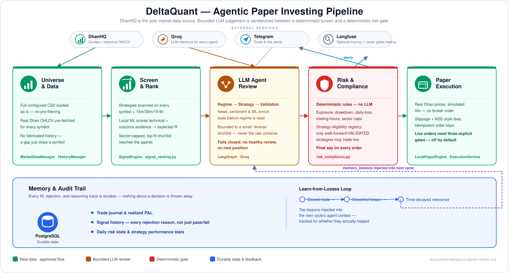
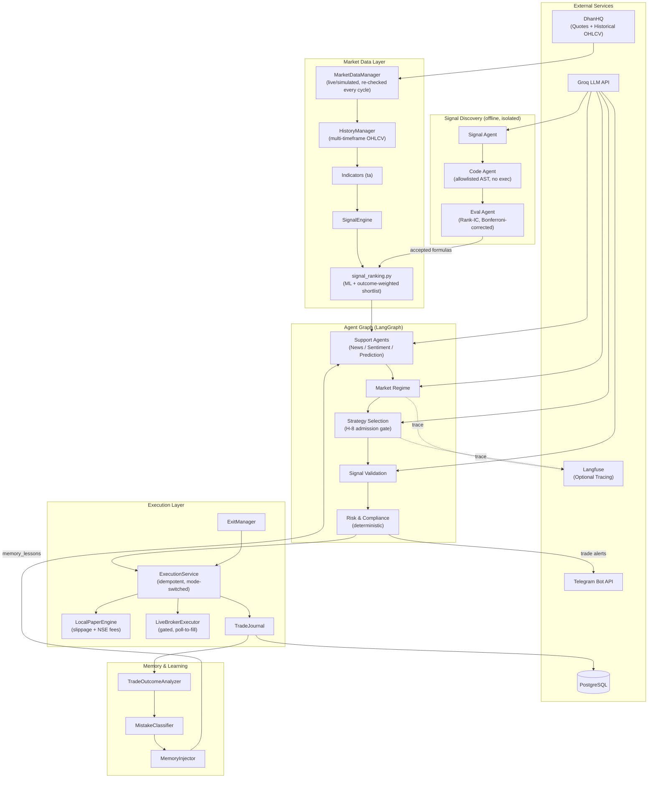
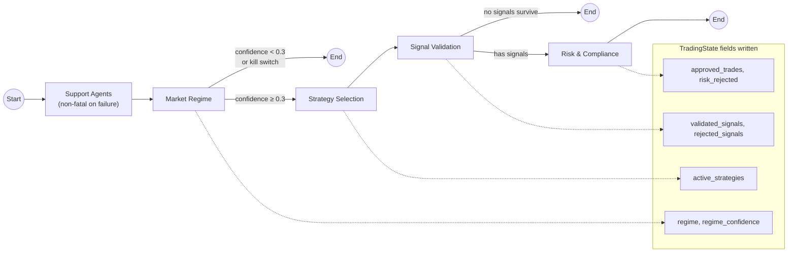
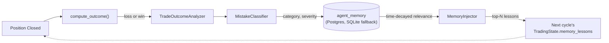
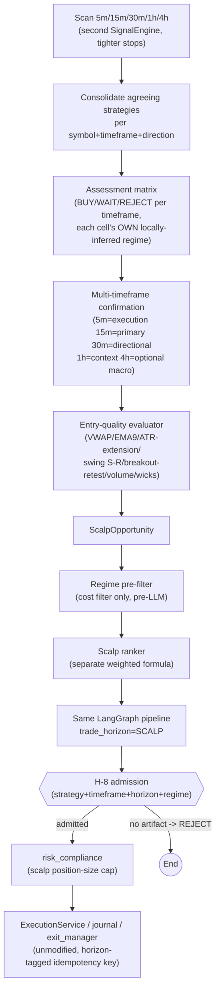

<div align="center">

# DeltaQuant

### Agentic Paper Investing for the NSE

_A LangGraph agent team that reasons about the market — a deterministic engine that has the final word_

[](LICENSE)
[](pyproject.toml)
[](web/package.json)
[](https://github.com/langchain-ai/langgraph)
[](https://groq.com)
[](https://dhan.co)
[](#safety-defaults)

</div>

---

## About This Project

**DeltaQuant** is a long-only, paper-investing research workflow for the Indian NSE market.
It uses **LangGraph** to orchestrate a team of specialized agents that classify market
regime, select strategies, validate signals, and hand final approval to a deterministic
risk engine — running against real DhanHQ market data with local, simulated execution.

Instead of hardcoded rules alone, DeltaQuant adds **cognitive flexibility**: LLM agents
reason about *why* a setup does or doesn't fit the current regime, while a rules-based risk
engine — not an LLM — keeps the authority to say no.

DeltaQuant is built for research and paper validation. It is **not** investment advice, it
does not promise returns, and live order routing is disabled by default (see
[Safety Defaults](#safety-defaults)).

### Key Capabilities

- **Universe-first scanning** — every configured symbol gets real Dhan data and strategy
  analysis every cycle; nothing is pre-filtered before the evidence exists.
- **Bounded agent review** — a small, diversified, evidence-ranked shortlist reaches the
  LLM team, not the raw universe; a degraded or unavailable LLM fails **closed**.
- **Deterministic risk gate** — position sizing, exposure, drawdown, trading-hours, and
  strategy-admission checks are rules, not model output.
- **Real/simulated data lineage** — quotes and indicators switch live↔simulated with
  market hours, but a position's `entry_data_source` is fixed at entry so an open real
  trade is never re-evaluated against simulated prices.
- **Walk-forward strategy admission (H-8 gate)** — a strategy only trades live once it
  clears an out-of-sample, cost-aware `VALIDATED` verdict; unvalidated strategies are
  blocked at both signal validation and the risk engine.
- **First-class scalping horizon** — a parallel, independently-governed 5m/15m pipeline
  (multi-timeframe confirmation, deterministic entry-quality checks, its own ranking and
  risk sizing) that shares the swing path's agent graph and H-8 gate rather than
  duplicating or loosening it. Off by default; see [Scalping](#scalping-5m15m-trade-horizon).
- **Self-improving memory** — a closed learn-from-losses loop classifies closed trades into
  lessons and tracks whether acting on them actually helped.
- **FinOps** — per-agent, per-day Groq token/cost accounting with soft/hard budgets and a
  spend kill-switch.
- **Profit-target engine** — turns a monthly return goal into a risk-bounded plan; it can
  only recommend *lowering the target*, never raising risk.
- **Realistic paper trading** — slippage + NSE-style brokerage/STT/GST, risk-based position
  sizing, durable Postgres-backed state.
- **Gated live trading** — one mode-switched execution path with idempotent orders, a
  shadow mode, and broker reconciliation; real orders fire only behind an explicit,
  three-gate opt-in.
- **Quantitative signal discovery** — an LLM-driven alpha-research loop (Signal / Code /
  Eval agents) that proposes, compiles, and statistically validates new formulas offline,
  isolated from execution.

---

## Architecture



### System Overview



### Agent Workflow Detail



### Memory Feedback Loop



Each stage has a distinct responsibility:

1. **Universe load.** At startup, the full `STOCK_UNIVERSE_CSV_PATH` universe (or the
   built-in NIFTY50+midcap list if unset) is loaded as-is — no pre-filtering. Dhan security
   IDs are resolved and historical OHLCV is pre-fetched for every symbol.
2. **Strategy scan.** Every cycle, each available symbol receives deterministic strategy
   analysis on `SIGNAL_TIMEFRAMES`. Forming candles are excluded by default to avoid
   intra-bar repainting.
3. **Local ranking.** A local scikit-learn direction model scores only symbol/timeframe
   pairs where a strategy fired. Technical confidence, sample-smoothed closed-trade
   outcomes, and risk/reward combine into an estimated win probability and expected R.
4. **Shortlisting.** Ranked symbols are capped per sector and truncated to
   `MAX_ACTIVE_STOCKS`. Only the top `LLM_REVIEW_MAX_SYMBOLS` receive news enrichment and
   LLM agent review.
5. **Agent review.** A failed or degraded LLM review is analysis-only — it can never create
   a paper or broker position (fail-closed).
6. **Final authority.** The deterministic risk engine and the long-only paper engine have
   the last word regardless of what the agents recommend.

## Safety Defaults

The checked-in `.env.example` is deliberately conservative:

| Setting | Default | Meaning |
| --- | --- | --- |
| `TRADING_MODE` | `paper` | No live-trading mode by default. |
| `EXECUTION_MODE` | `local_paper` | Orders are simulated locally. |
| `ALLOW_LIVE_ORDERS` | `false` | Real Dhan order submission is disabled. |
| `LONG_ONLY` | `true` | Buys open holdings; sells only close owned holdings. |
| `MARKET_DATA_SOURCE` | `dhan` | Quotes and historical candles come from DhanHQ. |
| `ENABLE_DHAN_HISTORICAL_DATA` | `true` | Indicators use Dhan OHLCV only. |
| Synthetic history | disabled | A symbol without Dhan history is skipped, never fabricated. |
| Agent fallback | fail closed | Degraded LLM review cannot open a new position. |

`local_paper` uses real Dhan prices but keeps the wallet, fills, fees, and positions in a
local, durable paper ledger. It never calls the broker order endpoint. Reaching `live`
execution requires clearing **three independent gates** at once — `trading_mode=live`,
`allow_live_orders=true`, and valid Dhan credentials — and `dhan_paper` always resolves to a
simulated fill (no verified Dhan sandbox exists), so it can never reach a live route
regardless of credentials.

## Prerequisites

| Requirement | Version | Used for |
| --- | --- | --- |
| [Python](https://www.python.org/) | 3.11+ | Backend agent pipeline and trading loop |
| [uv](https://github.com/astral-sh/uv) | latest | Python dependency management |
| [Node.js](https://nodejs.org/) | 18+ | Web dashboard (optional) |
| [PostgreSQL](https://www.postgresql.org/) | any recent | Agent memory, signal history, paper ledger |
| [DhanHQ](https://dhan.co/) account | — | Live market data (quotes + historical OHLCV) |
| [Groq](https://groq.com/) API key | — | LLM agent reasoning (free tier is sufficient) |

Without a Dhan account, the live loop automatically falls back to simulated data instead of
failing — useful for evaluating the system end to end before wiring up a broker.

## Quick Start

### 1. Clone and install

```bash
git clone https://github.com/ven2day/deltatrading.git
cd deltatrading
uv sync --extra dev --extra web
```

### 2. Guided setup

```bash
uv run python scripts/setup.py
```

This creates `.env` from `.env.example` if it's missing, checks which keys are set, and
prints a `[READY]` / `[ACTION]` checklist. Add your **free** Groq key
([console.groq.com/keys](https://console.groq.com/keys)) and Dhan credentials, then re-run it
to confirm `[READY]`. Keep these safeguards in place while evaluating the system:

```dotenv
TRADING_MODE=paper
EXECUTION_MODE=local_paper
ALLOW_LIVE_ORDERS=false
LONG_ONLY=true
MARKET_DATA_SOURCE=dhan
ENABLE_DHAN_HISTORICAL_DATA=true
ENABLE_DHAN_QUOTES=true
```

Also required: `STOCK_UNIVERSE_CSV_PATH` pointing to a CSV with a `symbol` column, and
`DATABASE_URL` for PostgreSQL.

### 3. Run it

```bash
uv run python scripts/check_config.py            # validate config first
uv run --extra web python scripts/run_live_trading.py
```

The backend dashboard API is served at `http://127.0.0.1:8010` once `ENABLE_WEB_UI=true` is
set in `.env` (generate the login with `scripts/set_dashboard_password.py` first — see
[Scripts Reference](#scripts-reference)).

### 4. Start the web dashboard (optional)

```bash
cd web
npm install
cp .env.local.example .env.local   # set NEXT_PUBLIC_WS_URL if the backend isn't local
npm run dev
```

Open `http://localhost:3000`.

### Running everything on a VPS

```bash
./scripts/start_all.sh   # backend + frontend, backgrounded with PID files under run/
./scripts/stop_all.sh    # stop both cleanly
```

### Validate before you trade real money

```bash
uv run python scripts/validate_strategy.py
```

A single in-sample backtest proves nothing. `validate_strategy.py` runs the live signal
logic on rolling **out-of-sample** windows, **net of realistic NSE costs** (slippage +
brokerage + STT/stamp/GST via `CostModel`), and prints a blunt **VALIDATED / NOT VALIDATED**
verdict — it requires ≥30 OOS trades, positive net expectancy *and* return, and >50% fold
consistency, not one lucky window. Treat a green verdict as *necessary, not sufficient*: the
universe is current-listed names only (no survivorship-free dataset), and historical bars
can't capture circuit limits, gaps, or thin-name liquidity.

## Scripts Reference

| Script | Purpose |
| --- | --- |
| `scripts/setup.py` | Guided first-run setup: creates `.env`, checks keys, prints readiness |
| `scripts/check_config.py` | Validates `.env` / settings without starting the trading loop |
| `scripts/run_live_trading.py` | **Main entry point** — live/paper trading loop + dashboard |
| `scripts/validate_strategy.py` | Out-of-sample walk-forward edge validation (H-8 admission gate) |
| `scripts/discover_signals.py` | On-demand quantitative signal-discovery run |
| `scripts/backfill_signal_history.py` | Replays historical bars into the signal-history log |
| `scripts/diagnose_risk.py` | Runs a synthetic signal through the risk engine to debug rejections |
| `scripts/set_dashboard_password.py` | Generates the web UI login credentials |
| `scripts/test_dhan_connection.py` | Verifies Dhan API credentials and connectivity |
| `scripts/start_all.sh` / `stop_all.sh` | Start/stop backend + frontend together on a VPS |

## Universe and Review Controls

The full configured CSV receives local strategy analysis. The controls below limit the
ranked shortlist and LLM workload — not signal-generation coverage.

| Setting | Purpose | Typical value |
| --- | --- | --- |
| `LLM_REVIEW_ALL_SIGNALS` | Send every generated strategy signal to the agent graph, bypassing shortlist caps. | `false` |
| `MAX_ACTIVE_STOCKS` | Maximum sector-diverse symbols kept after local ranking. | `15` |
| `LLM_REVIEW_MAX_SYMBOLS` | Maximum ranked symbols sent to the agent graph. | `5` |
| `UNIVERSE_MAX_PER_SECTOR` | Maximum shortlisted names from one sector. | `2` |
| `MAX_SIGNALS_PER_SYMBOL` | Maximum high-confidence signals per reviewed name. | `2` |
| `TRADING_CYCLE_SECONDS` | Interval between full agent review cycles. | `120` |
| `SIGNAL_TIMEFRAMES` | Comma-separated Dhan timeframes. | `15m,30m,1h,4h` |

Sending hundreds of raw quote records to an LLM on every cycle is slow and expensive. Local
strategies and ML cover the full universe; Groq reviews only the strongest evidence. Set
`LLM_REVIEW_ALL_SIGNALS=true` to send every generated signal instead — the daily FinOps
budget still gates new LLM cycles regardless.

## Agent Team

| Agent | Responsibilities | Execution type |
| --- | --- | --- |
| **News Analyst** | Scans Google News RSS and scores sentiment. | LLM-assisted |
| **Sentiment Agent** | Builds a market mood index (fear/greed). | Deterministic/hybrid |
| **Prediction Agent** | Short-horizon ML direction estimates. | scikit-learn |
| **Market Regime** | Classifies trending/ranging/volatile context. | Groq LLM |
| **Strategy Selection** | Selects compatible strategies; enforces the H-8 admission gate. | Groq LLM |
| **Signal Validation** | Filters raw technical signals against the thesis. | Groq LLM |
| **Risk & Compliance** | Enforces position, loss, exposure, and time rules. | Deterministic rules engine |

The agents review candidates; they do not replace data quality, portfolio construction, or
risk controls. `risk_compliance` is a rules engine, not an LLM, and has final say on every
entry — an LLM response can be unavailable, rate-limited, or malformed, and the graph must
never crash or silently approve a trade when that happens.

## Scalping (5m/15m Trade Horizon)

Alongside the swing pipeline above (which trades on `15m`–`4h` evidence), DeltaQuant has a
second, **independently-governed** trade horizon purpose-built for 5-15 minute NSE scalps.
It is off by default (`SCALP_ENABLED=false`) and, when off, changes nothing about swing
behavior — every module involved is either new or an additive extension of an existing one.

### Why a separate pipeline, not a flag on the existing one

Scalp and swing candidates need different evidence. Entry timing quality and multi-timeframe
alignment matter far more on a 5-minute chart than they do for a multi-hour position, while a
single strategy's long-run historical win rate matters less (regimes shift faster, sample
sizes are smaller). Rather than bolt a `horizon` parameter onto the existing ranking formula
and risk rules, scalping gets its **own** ranker, its **own** deterministic entry-quality
evaluator, and its **own** admission grain in the H-8 registry — while reusing the *same*
LangGraph agent nodes, the *same* risk-compliance checks, and the *same* execution/journal/
exit-manager stack the swing path already relies on.

### Pipeline



Every stage is visible in `dashboard.stats.scalp_funnel` each cycle — raw triggers →
consolidated → mtf-confirmed → entry-quality-passed → regime-compatible → H-8 admitted →
sent to AI → AI approved → execution accepted — so "why didn't this symbol trade" is always
answerable from the dashboard, not a log dive. The web UI's **Scalp Decisions** tab renders
the live per-symbol 5m/15m/30m/1h matrix, score, entry quality, preferred entry range, stop,
target, expected R, and final decision.

### H-8 stays fail-closed — extended, never bypassed

The strategy-admission registry's grain grew from just a strategy name to
**strategy + timeframe + trade_horizon + regime + version**. Every artifact registered before
this existed defaults to `trade_horizon="SWING"` and an unpinned timeframe, so it keeps
admitting exactly what it always did — and can **never** match a `SCALP` request. A strategy
only becomes eligible for live scalp trades once someone deliberately runs:

```bash
uv run python scripts/validate_strategy.py --interval 5m --trade-horizon SCALP
```

This walk-forward-validates the strategy on **real 5-minute bars** (previously, the
validation path silently fetched and labeled everything as daily bars regardless of what was
requested — fixed alongside this feature) and registers a version admissible only to matching
`trade_horizon=SCALP` requests. Until that command has been run for a given strategy, every
scalp candidate for it is rejected at H-8 with an explicit "no current VALIDATED registry
artifact" reason — that's the gate working correctly, not a bug, and it's the same
fail-closed backstop check #14 in `risk_compliance` enforces independently of
`strategy_selection`'s own gate.

### What is and isn't horizon-specific

| Shared with swing, unchanged | Scalp-specific |
| --- | --- |
| LangGraph nodes (regime/strategy/validation/risk) | A second ranking formula (`scalp_ranking.py`) |
| `ExecutionService`, `sizing.py`, journal, exit manager | A deterministic entry-quality evaluator |
| Kill switch, FinOps budget (shared pool by design) | Tighter position-size cap & stop/target defaults |
| Idempotency store, lifecycle recovery | A namespaced `scalp::<strategy>` performance-history key |

### Key settings

| Setting | Default | Meaning |
| --- | --- | --- |
| `SCALP_ENABLED` | `false` | Master switch for the entire scalp scan/rank/gate pipeline. |
| `SIGNAL_TIMEFRAMES` | `15m,30m,1h,4h` | Add `5m` here too if you want swing's own scan to also consider 5-minute signals. |
| `SCALP_CONFIRMATION_TIMEFRAMES` | `5m,15m,30m,1h,4h` | Full role set the assessment matrix is built over. |
| `SCALP_REQUIRED_MTF_ALIGNMENT` | `3` | Minimum confirming timeframes before a candidate proceeds. |
| `SCALP_MACRO_FILTER_ENABLED` | `true` | Whether the optional 4h macro-context role participates. |
| `SCALP_RISK_PER_TRADE` / `SCALP_MAX_POSITION_PCT` | `0.01` / `0.05` | Tighter than swing's `0.02` / `0.10`, matching a 5-15m holding period. |
| `SCALP_MIN_RR` / `SCALP_MIN_CONFIDENCE` | `1.5` / `0.6` | Fallback-validation bar — shipped equal to swing's hardcoded bar, never silently lower. |
| `SCALP_MAX_ACTIVE_SYMBOLS` | `5` | Scalp analogue of `MAX_ACTIVE_STOCKS`. |

See `.env.example` for the complete list, including the entry-quality thresholds
(`SCALP_VWAP_MAX_DISTANCE_PCT`, `SCALP_ATR_EXTENSION_MAX_MULTIPLE`, `SCALP_WICK_RATIO_MAX`, …)
and the six `SCALP_RANKING_WEIGHT_*` fields (validated at startup to sum to ~1.0).

### Try it

```bash
# 1. Validate at least one strategy for the SCALP horizon (hits the real Dhan API).
uv run python scripts/validate_strategy.py --interval 5m --trade-horizon SCALP

# 2. Enable it and run.
SCALP_ENABLED=true uv run --extra web python scripts/run_live_trading.py
```

Watch the activity log for `Scalp funnel: ...` lines each cycle, and open the **Scalp
Decisions** tab in the web dashboard for the live decision table.

## Quantitative Signal Discovery

An LLM-driven alpha-research loop (Signal / Code / Eval agents, in the spirit of NVIDIA's
quantitative-signal-discovery pattern) is adapted to the existing Groq, Dhan, FinOps, and
paper-trading stack. With `SIGNAL_DISCOVERY_AUTO_RUN=true`, it researches the full
configured universe on `15m`, `30m`, `1h`, and `4h` automatically every 24 hours. This
schedule is separate from the 120-second trading cycle, so formula generation never delays
quotes, exits, or deterministic strategy scanning. An on-demand run is also available:

```bash
uv run python scripts/discover_signals.py "volume-adjusted momentum"
```

The **Signal Agent** proposes formulas from a fixed operator allowlist. A deterministic
local **Code Agent** compiles them as a restricted AST walk (never `exec`/`eval`), and the
**Eval Agent** computes cross-sectional Spearman Rank-IC against forward returns. Failed
formulas receive Groq optimization feedback and retry. Only candidates clearing both
`abs(IC) >= SIGNAL_DISCOVERY_IC_THRESHOLD` and a **Bonferroni-corrected** p-value bar are
persisted under `data/discovered_signals/<timeframe>/`.

When `SIGNAL_DISCOVERY_ENABLED=true`, accepted artifacts are re-validated at load, evaluated
on the live cross-sectional Dhan panel, sign-inverted when IC is negative, standardized, and
applied as a small, bounded probability tilt to a strategy signal on the matching timeframe
— **never** to position sizing or risk gates. Discovery never submits an order.

## Data and Execution Model

- **Quotes.** `MarketDataManager` tracks the full configured universe directly from startup
  (no pre-narrowing scan) — live via WebSocket where subscription coverage exists, REST
  polling otherwise, re-checked against market hours every cycle (not a static
  startup flag). `MAX_ACTIVE_STOCKS` only bounds the post-ML ranked shortlist, not what
  gets quoted or strategy-scanned.
- **History.** `DhanHistoricalFeed` obtains Dhan candles, paginated past Dhan's 90-day API
  window. Daily OHLCV is constructed from Dhan 60-minute data because the daily endpoint can
  reject otherwise-valid requests. History is cached locally for reuse.
- **No fabricated data.** Symbols without sufficient real OHLCV are excluded from review for
  that cycle.
- **Data lineage.** A position's `entry_data_source` (`real` or `simulated`) is fixed once at
  entry and used to resolve which price feed prices it going forward — a real position is
  never silently re-priced against simulated data mid-trade, or vice versa.
- **Paper fills.** `LocalPaperEngine` applies configurable slippage and NSE-style
  brokerage/STT/GST, does correct long/short/partial FIFO accounting, and persists the
  wallet and positions to PostgreSQL — no cash leak on shorts, no local JSON file.
- **Exits.** `ExitManager` handles stop, target, trailing, partial, time, and regime exits
  for existing positions.
- **Live execution safety.** Every order carries an idempotency key (a repeat returns
  `DUPLICATE`, not a second fill); `shadow` mode mirrors a live decision and sizing without
  sending anything; `LiveBrokerExecutor` polls to a **terminal fill** rather than assuming
  `PLACED == filled`; `reconcile_positions` checks local vs. broker state at startup.

## Backtesting

```python
from src.backtesting import BacktestEngine
from src.backtesting.strategies import RealSignalStrategy

engine = BacktestEngine(initial_capital=100000)
data = engine.fetch_data("RELIANCE", period="1y")
result = engine.run(RealSignalStrategy(), data, symbol="RELIANCE")
result.print_summary()
```

`RealSignalStrategy` runs the **live** `calculate_indicators` + `SignalEngine` — the only
strategy here that's faithful to what actually runs in production (the others are standalone
re-implementations for comparison and will diverge). The engine uses strictly-prior bars, so
there's no look-ahead; pass `BacktestEngine(cost_model=CostModel(...))` for realistic NSE
fees, or `CostModel.zero()` for ideal fills.

Prove a change actually helps, rather than eyeballing two numbers:

```python
from src.backtesting.engine import compare_results

report = compare_results(baseline_result, candidate_result)
print(report["improved"], report["deltas"])  # return/win-rate/expectancy/Sharpe/drawdown
```

## Dashboard and Audit Trail

The FastAPI backend exposes state, signal history, paper trades, and health data over a
WebSocket + REST API. The Next.js web UI shows:

- **Overview** — live pipeline-stage status strip, open positions, account, regime, agent
  activity, and session cost.
- **Charts** — real NSE candlesticks (IST-aware) with entry/SL/TP overlays and OHLCV.
- **Sector Movers** / **Scalping Candidates** — cross-sectional screens outside the main loop.
- **Scalp Decisions** — the live 5m/15m/30m/1h assessment matrix, entry quality, and final
  decision for every ranked scalp candidate (see [Scalping](#scalping-5m15m-trade-horizon)).
- **Signal History** — every signal's final disposition (approved / rejected-at-validation /
  rejected-at-risk), with the actual reason, not just a pass/fail flag.
- **Trade History** — closed paper trades and realized P&L.
- **System Status** — a live health check across market data, the LLM provider, the
  database, and every optional integration.

The following records are durable in PostgreSQL: paper orders and reconstructed closed-trade
history, trade journal entries and net realized P&L, signal history with validation/risk
rejection reasons, and daily risk state, performance statistics, and learning-loop outcomes.

A reduced cash balance is not by itself a loss — it can represent capital held in an open
paper position. Use total portfolio value and trade history together when reconciling the
account.

## Telegram Alerts

Get trade and risk notifications on your phone:

1. Create a bot via [`@BotFather`](https://t.me/BotFather) on Telegram.
2. Get your chat ID via [`@userinfobot`](https://t.me/userinfobot).
3. Add to `.env`:

```dotenv
TELEGRAM_ENABLED=true
TELEGRAM_BOT_TOKEN=your_bot_token
TELEGRAM_CHAT_ID=your_chat_id
```

## Observability

[Langfuse](https://langfuse.com) tracing is optional and purely observational — it never
gates Dhan, Groq, or paper execution, and nothing in the decision pipeline depends on it
being enabled. When configured, every agent call and full trading cycle is traced, so
questions like *"why did the agent reject the BUY signal for TCS?"* or *"what regime did it
detect before this trade?"* are answerable from the Langfuse dashboard instead of raw logs.

```dotenv
LANGFUSE_TRACING_ENABLED=true
LANGFUSE_PUBLIC_KEY=pk-...
LANGFUSE_SECRET_KEY=sk-...
```

## Project Structure

```
DeltaQuant/
├── src/
│   ├── agents/                    # 🧠 The "brain" — LangGraph nodes
│   │   ├── graph.py                 # Builds the StateGraph, wires conditional edges
│   │   ├── market_regime.py         # Groq: trending / ranging / volatile classification
│   │   ├── strategy_selection.py    # Groq: active strategies + H-8 admission gate
│   │   ├── signal_validation.py     # Groq: filters raw technical signals
│   │   ├── risk_compliance.py       # Deterministic rules engine — final say on every order
│   │   ├── news_analyst.py          # Google RSS sentiment scoring
│   │   ├── sentiment.py             # Market mood index (fear/greed)
│   │   ├── prediction.py            # scikit-learn short-horizon direction model
│   │   └── llm_factory.py           # Provider-agnostic chat model + rate limiter/breaker
│   ├── market/                    # 🌐 Data ingestion, indicators, ranking
│   │   ├── manager.py               # MarketDataManager — live/simulated auto-switch
│   │   ├── history_manager.py       # Multi-timeframe OHLCV history
│   │   ├── dhan_quotes_feed.py      # DhanHQ REST quotes
│   │   ├── dhan_historical_feed.py  # Paginated Dhan historical candles (90-day API cap)
│   │   ├── websocket_feed.py        # DhanHQ live WebSocket client
│   │   ├── simulated_data.py        # Deterministic market simulator (after-hours)
│   │   ├── signals.py               # SignalEngine — strategy signal generation
│   │   ├── signal_ranking.py        # ML + outcome-weighted shortlist ranking (swing)
│   │   ├── sizing.py                # Risk-based position sizing (Kelly-aware)
│   │   ├── stock_discovery.py       # Dynamic symbol discovery
│   │   ├── signal_consolidation.py  # Scalp: merge agreeing strategies per symbol/timeframe
│   │   ├── assessment_matrix.py     # Scalp: per-timeframe BUY/WAIT/REJECT matrix
│   │   ├── regime_compatibility.py  # Scalp: deterministic pre-LLM compatibility filter
│   │   ├── entry_quality.py         # Scalp: deterministic EntryQualityEvaluator
│   │   ├── scalp_confirmation.py    # Scalp: multi-timeframe confirmation (5m-4h roles)
│   │   ├── scalp_opportunity.py     # Scalp: ScalpOpportunity canonical domain object
│   │   ├── scalp_ranking.py         # Scalp: separate weighted ranking formula
│   │   ├── scalp_scan.py            # Scalp: orchestrates one cycle's full scan->rank pass
│   │   └── price_geometry.py        # Shared EMA/VWAP/ATR/wick/zigzag-pivot helpers
│   ├── execution/                 # ⚡ Order execution
│   │   ├── service.py               # ExecutionService — idempotent, mode-switched
│   │   ├── live_executor.py         # Live fill-lifecycle + broker reconciliation
│   │   ├── paper_engine.py          # Local paper trading (costs, shorts, atomic state)
│   │   ├── costs.py                 # Slippage + NSE-style fee model
│   │   ├── exit_manager.py          # Trailing / time / partial exits
│   │   ├── signal_log.py            # Durable signal-history audit trail
│   │   └── journal.py               # Durable trade history
│   ├── finops/                    # 💰 Cost tracking, budgets, alerts
│   │   ├── cost_tracker.py          # Per-agent, per-day Groq token/cost accounting
│   │   └── alerts.py                # Budget + risk alerting (logs + Telegram)
│   ├── profit/                    # 🎯 Profit-target goal engine
│   │   └── goal_engine.py           # Risk-bounded plan + on/off-pace tracker
│   ├── backtesting/                # 📈 Strategy testing
│   │   ├── engine.py                # Backtest runner + compare_results scorecard
│   │   ├── walk_forward.py          # OOS validation → VALIDATED / NOT VALIDATED verdict
│   │   └── strategies.py            # RealSignalStrategy (uses the live engine) + others
│   ├── signal_discovery/           # 🔬 Quantitative signal-discovery workflow
│   │   ├── workflow.py              # Signal / Code / Eval agent orchestration
│   │   ├── operators.py             # Allowlisted formula compiler (restricted AST, no exec)
│   │   ├── evaluator.py             # Cross-sectional Rank-IC evaluation
│   │   └── live.py                  # Applies accepted formulas as a bounded tilt
│   ├── memory/                     # 📚 Learn-from-losses feedback loop
│   │   ├── analyzer.py              # TradeOutcomeAnalyzer
│   │   ├── classifier.py            # MistakeClassifier
│   │   ├── injection.py             # MemoryInjector — feeds lessons back into state
│   │   └── feedback.py              # Closes the loop at trade close
│   ├── utils/                      # 🔧 Utilities
│   │   ├── rate_limiter.py          # Token-bucket Groq rate limiting
│   │   ├── circuit_breaker.py       # Trips on repeated LLM failures
│   │   ├── market_time.py           # IST (UTC+05:30) market-time helpers
│   │   └── cache.py                 # TTL cache for news / quotes / sentiment
│   ├── notifications/               # 📱 Alerts
│   │   └── telegram.py              # Trade & risk notifications
│   ├── observability/               # 🔍 Optional tracing
│   │   └── tracing.py               # Langfuse spans per agent + per cycle
│   ├── webui/                       # 🖥️ Web dashboard backend
│   │   ├── server.py                # FastAPI app + WebSocket broadcast hub
│   │   ├── auth.py                  # Signed-session dashboard login
│   │   └── candles.py               # OHLCV endpoint for the Charts tab
│   ├── api/                         # ✅ Health checks
│   │   └── health.py                # Per-service status for the System Status tab
│   ├── db/                          # 🗄️ Persistence
│   │   └── base.py                  # SQLAlchemy engine/session + column migrations
│   ├── dashboard/                   # 📊 Shared stats model
│   │   └── stats.py                 # TradingStats dataclass consumed by the web backend
│   └── config/                      # ⚙️ Configuration
│       └── settings.py              # pydantic-settings — fails closed on unsafe combos
├── web/                        # Next.js dashboard frontend
│   ├── app/page.tsx               # Tab layout (Overview, Charts, Signals, ...)
│   ├── components/                 # PipelinePanel, TradeChartsPanel, SignalHistoryPanel, ...
│   └── lib/                        # WebSocket hooks, API client, IST-aware formatting
├── scripts/                    # 🏃 Entry points — see Scripts Reference above
│   ├── setup.py                   # Guided one-command setup
│   ├── run_live_trading.py        # Main application — trading loop + dashboard
│   ├── validate_strategy.py       # OOS / walk-forward edge validation (H-8 gate)
│   ├── check_config.py            # Config validator
│   ├── diagnose_risk.py           # Replays a signal through the risk engine to debug rejections
│   └── start_all.sh / stop_all.sh # VPS start/stop for backend + frontend
├── tests/                      # 🧪 pytest suite
├── docs/                       # 📖 Architecture and design documentation
└── .env.example                # Full, documented configuration reference
```

## Configuration Notes

- Langfuse tracing is optional observability only (see [Observability](#observability)) — it
  never gates or influences trading decisions.
- Groq rate limits or malformed agent responses are visible in logs. The system retains
  prior analysis but blocks new entries until a healthy review completes.
- `dhan_paper` and `live` execution modes are separate from `local_paper`. Do not enable
  `live` orders without independently validating the full workflow in paper mode first.
- Signal discovery is an experimental research process, not evidence of future
  profitability. Paper validation remains required after Rank-IC acceptance.

## Testing and Quality

```bash
uv sync --extra dev --extra web

uv run --extra dev pytest -q                # full test suite
uv run --extra dev pytest --cov=src         # with coverage
uv run --extra dev ruff check .             # lint
uv run --extra dev ruff format .            # format
uv run --extra dev mypy src                 # type-check (strict mode)
```

## Documentation

| Document | Contents |
| --- | --- |
| [Introduction](docs/1_Introduction.md) | Project goals and scope |
| [High-Level Design](docs/2_High_Level_Design.md) | System architecture overview |
| [Low-Level Design](docs/3_Low_Level_Design.md) | Module- and function-level detail |
| [System Design Decisions](docs/4_System_Design.md) | Key trade-offs and rationale |
| [Component Reference](docs/5_Components.md) | Per-component reference |

## Security

- Never commit `.env` — it is gitignored, and `.env.example` is the tracked reference for
  required variables.
- All secrets (`GROQ_API_KEY`, `DHAN_ACCESS_TOKEN`, `DATABASE_URL`, etc.) are loaded via
  `pydantic-settings` `SecretStr` fields, never logged in plain text.
- Report a vulnerability by opening a private security advisory on this repository rather
  than a public issue.

## Disclaimer

> **Educational and research purposes only.** DeltaQuant is a paper-trading system. It does
> not execute real orders unless `TRADING_MODE=live`, `ALLOW_LIVE_ORDERS=true`, and valid
> broker credentials are **all** explicitly configured. Nothing in this repository is
> financial advice. Past performance — paper or backtested — does not guarantee future
> results. Trade at your own risk.

## License

Released under the [MIT License](LICENSE).
