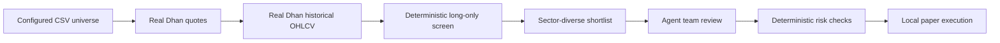

# Introduction

## Purpose

DeltaQuant is an NSE long-only investing workflow that uses DhanHQ market data
and local paper execution. It is built to answer a practical portfolio question:
which names in the entire configured universe deserve deeper review today?

It is not a system that asks an LLM to scan hundreds of raw tickers or to write
trading code at runtime. Broad screening is deterministic; LLMs review a small,
well-defined set of real-data candidates.

## Operating Model

The configured CSV is the source of truth for the investment universe. Every
symbol is refreshed from DhanHQ, checked against real cached OHLCV, and scored
for a controlled pullback in an established trend. The result is diversified by
sector and capped before multi-timeframe analysis and agent review.

The screen and risk checks are not optional LLM outputs. They are hard system
boundaries.

## Principles

### Real data only

Historical data used for live analysis comes from DhanHQ. If a symbol lacks
sufficient real history, it is skipped. The live workflow does not seed
synthetic candles to keep an analysis cycle alive.

### Long-only cash investing

With `LONG_ONLY=true`, a BUY opens a holding and a SELL can only close shares
already held. The system cannot use a SELL signal to open a short position.

### Fail closed

An LLM fallback, rate limit, parsing error, stale market data, risk breach, or
kill switch blocks new entries. Existing exits continue to be managed. This is
particularly important because the agent graph is advisory and probabilistic.

### Durable accounting

The paper wallet, order ledger, trade journal, daily risk state, signal history,
and learning records are persisted. A restart must not make positions or P&L
disappear from the dashboard.

## What Is And Is Not Paper Trading

`EXECUTION_MODE=local_paper` uses real Dhan market prices while simulating fills,
slippage, charges, wallet balance, and positions locally. It does not submit a
Dhan broker order. A paper balance can decrease when capital is held in an open
position; total portfolio value is the relevant account-level measure.

Real broker execution requires both a compatible execution mode and
`ALLOW_LIVE_ORDERS=true`. Those are deliberately separate decisions.

## User-Facing Workflow

1. Maintain a CSV with a `symbol` column and set `STOCK_UNIVERSE_CSV_PATH`.
2. Run in `paper` and `local_paper` mode with Dhan data enabled.
3. Monitor the web dashboard, signal history, and trade history.
4. Reconcile paper total value, closed trades, open positions, and risk state.
5. Evaluate strategy quality with backtesting and walk-forward testing before
   considering any live broker mode.

## Scope

The system supports data ingestion, technical signals, bounded LLM review,
local paper execution, a web dashboard, learning from closed trades, and
operational controls. It does not guarantee signal quality, execution quality,
or investment performance.
