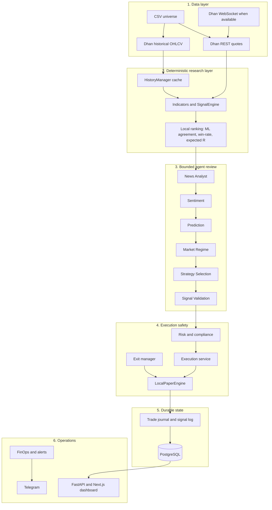
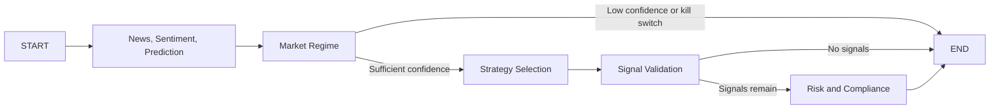

# High-Level Design

## Architecture

DeltaQuant has six layers. The ordering matters: the broad universe is scored
before the agent graph, and execution is gated after it.

## Universe-First Pipeline

The agent team receives the strongest locally ranked candidates from strategy
signals generated across the complete configured universe.

```mermaid
flowchart LR
    A[All configured symbols] --> B[Refresh real Dhan quotes]
    B --> C[Read cached real Dhan OHLCV]
    C --> D[Strategies on settled 15m, 30m, 1h, 4h bars]
    D --> E[Local sklearn direction scoring]
    E --> F[Blend closed-trade evidence and expected R]
    F --> G[Cap by sector]
    G --> H[Top N locally ranked symbols]
    H --> I[Top K LLM review]
    I --> J[Risk and execution gates]
```

Every configured symbol is evaluated on the configured settled candle
timeframes. Deterministic strategy triggers are ranked using technical
agreement, local sklearn direction agreement, sample-smoothed closed-trade
outcomes, and expected R. Sector caps are applied after ranking.

`MAX_ACTIVE_STOCKS` limits the locally ranked shortlist.
`LLM_REVIEW_MAX_SYMBOLS` limits the names that receive news and LLM context.
The complete CSV still receives multi-timeframe signal generation.
When `LLM_REVIEW_ALL_SIGNALS=true`, both limits and the sector/per-symbol caps
are bypassed and every generated signal is included in the agent input.

## Data Model

| Concern | Source | Behavior |
| --- | --- | --- |
| Current quotes | DhanHQ quote REST endpoint | Batched and rate-limited across the configured universe. |
| Daily history | DhanHQ 60-minute candles resampled to daily | Cached on disk and used for real indicator warm-up. |
| Intraday history | DhanHQ 15/60-minute candles and resampling | Cached with a timeframe TTL for the full signal universe. |
| Missing history | No substitution | Symbol is excluded from that review cycle. |
| News | Google News RSS | Best-effort support signal, never an execution authority. |

The Dhan daily endpoint can reject valid symbols. The historical feed therefore
constructs daily candles from Dhan 60-minute data rather than falling back to a
different provider or a synthetic series.

## Agent Review

The LangGraph graph is:

The graph receives only the reviewed symbols and their indicators. This keeps
context size, cost, latency, and prompt ambiguity bounded.

Agent failure does not silently become an execution decision. Any fallback or
degraded agent result is logged and prevents new paper or broker entries.

## Execution Modes

| Mode | Data | Order destination |
| --- | --- | --- |
| `local_paper` | Real Dhan prices | Durable local paper ledger only |
| `shadow` | Real Dhan prices | No order submission; records intent |
| `dhan_paper` | Dhan data | Dhan sandbox when configured |
| `live` | Dhan data | Dhan broker only with explicit opt-in |

`ALLOW_LIVE_ORDERS=false` is a master safety gate. A setting that names a live
mode is insufficient on its own to submit broker orders.

## Operations

The FastAPI backend publishes current dashboard state and durable history. The
Next.js frontend renders account state, positions, signal history, trade
history, sector movers, scalping candidates, activity, and system health.

Langfuse tracing is optional. An observability outage is an observability
issue, not a reason to fabricate data or bypass execution safety.
