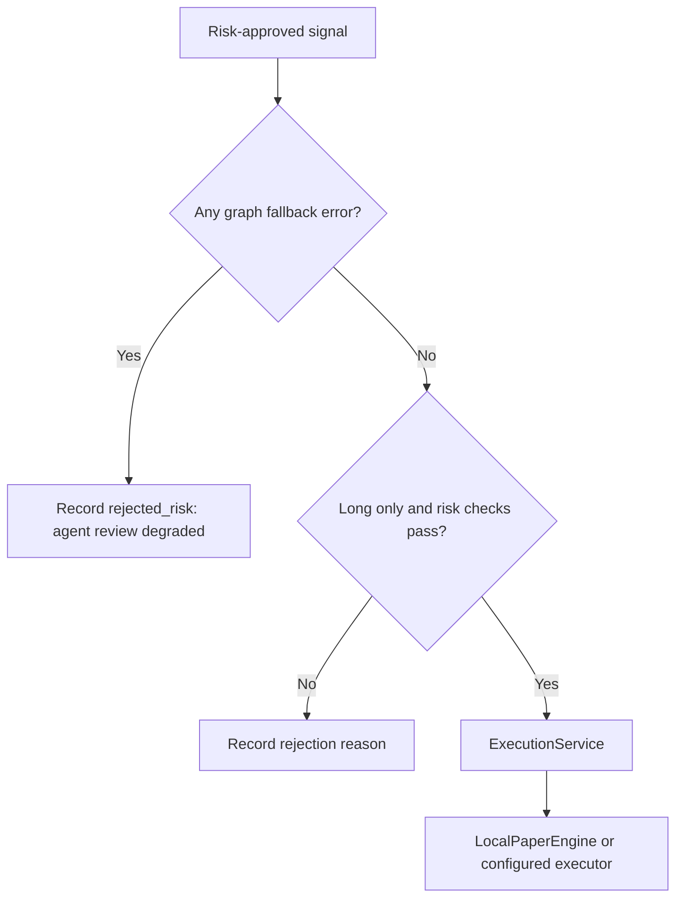

# Low-Level Design

## Runtime Entry Point

`scripts/run_live_trading.py` owns the long-running session. It loads settings,
starts the dashboard server, refreshes market data, manages exits, invokes the
screen and agent graph, and routes approved paper orders through the execution
service.

The loop is split into two concerns:

- **Every cycle:** quote refresh, position marking, exit management, dashboard
  refresh, universe screen, bounded agent review, and execution gates.
- **Startup:** instrument-master resolution, historical cache loading, durable
  state recovery, optional web server, sector movers, and scalping screener.

## Core Contracts

### Market quote

`src.market.manager.MarketQuote` is the runtime quote contract. It includes
symbol, last price, OHLC values, change percentage, cumulative volume, source
liveness, and timestamp.

### OHLCV

All historical paths normalize to a `pandas.DataFrame` with lower-case:

```text
open, high, low, close, volume
```

`HistoryManager` owns the in-memory and disk-cached daily series. It serves
settled daily bars and maintains separate intraday caches by `(symbol,
timeframe)`.

### Indicator result

`IndicatorResult` contains OHLCV, moving averages, RSI, stochastic, MACD, ADX,
ATR, Bollinger values, and VWAP. `to_dict()` produces the agent-safe
serialization format.

### Trading signal

`TradingSignal` is the bridge between deterministic strategies and the graph.
It contains:

- Symbol, strategy, timeframe, side, and confidence
- Entry, stop, target, risk/reward, and suggested position percentage
- Indicator evidence and human-readable reasons

## Local Signal Ranker

`src.market.signal_ranking.rank_signals()` is intentionally outside the LLM
graph. Strategies run first on every configured symbol and timeframe. Only
symbol/timeframe pairs with a trigger receive a local sklearn direction score.

```text
quote + cached settled multi-timeframe bars
    -> deterministic strategy signals
    -> local ML direction agreement
    -> Beta-smoothed strategy/regime outcomes
    -> estimated win probability and expected R
    -> score sort and sector cap
    -> 15 local survivors
    -> 5-symbol LLM review
```

History is cached with per-timeframe TTLs. M30 is derived from M15 and H4 from
H1, so the four-timeframe universe scan requires only two base history streams
per symbol. Unchanged ranked signal sets skip duplicate Groq/news review.

## Agent State

`TradingState` is the LangGraph blackboard. Important fields include:

| Field group | Produced by | Used by |
| --- | --- | --- |
| `market_data`, `indicators`, `signals` | Runtime loop | All review agents |
| `news_sentiment`, `market_mood`, `prediction_signals` | Support agents | Regime and validation |
| `regime`, `active_strategies` | Regime and strategy agents | Validation |
| `validated_signals`, `rejected_signals` | Validation agent | Risk agent and signal log |
| `approved_trades`, `risk_rejected` | Risk engine | Execution and audit |
| `errors` | Any graph stage | Fail-closed execution guard |

`run_trading_cycle()` coerces values to native Python types before checkpointing
so pandas and NumPy scalar values do not cross the msgpack boundary.

## Fail-Closed Execution Boundary

The runtime makes an explicit distinction between a normal review and a
degraded review.



The LLM graph can still provide diagnostic output while degraded. It cannot
open a new position. This protects both paper and live modes from a rate-limit
or parsing failure being mistaken for a trade decision.

## Paper Ledger

`LocalPaperEngine` restores state from the configured database on startup. It
tracks:

- Cash balance and initial balance
- Open positions, average fill data, and unrealized P&L
- Realized P&L and win/loss totals
- Individual order records with charges and adverse slippage
- Reconstructed closed-trade history from the durable order ledger

`TradingDashboard.sync_paper_account()` derives presentation data from engine
state instead of relying on ephemeral counters. The journal and signal log are
separate: journal records fills and exits; the signal log records every
considered signal and the reason it was rejected or approved.

## Configuration Boundaries

`Settings` is the only environment parsing surface. Important runtime groups:

| Group | Examples |
| --- | --- |
| Data | `MARKET_DATA_SOURCE`, Dhan credentials, quote/history toggles |
| Universe | `STOCK_UNIVERSE_CSV_PATH`, shortlist and sector controls |
| Agent workload | Groq model, rate limit, token budget, cycle interval |
| Risk | long-only, position size, daily loss, drawdown, sector exposure |
| Execution | trading mode, execution mode, live-order opt-in |
| Operations | web host/port, CORS, Telegram, Langfuse tracing |

Configuration validation emits warnings for unsafe combinations; it does not
silently change an execution mode.
