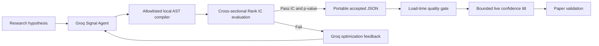

# System Design Decisions

## Deterministic Screening Before LLMs

The system uses LLMs for bounded judgement, not for broad market scanning. A
full universe may contain hundreds of names, while an LLM review is useful only
when supplied with concise, comparable evidence.

This is why DeltaQuant uses a two-stage architecture:

1. Deterministic screen: all configured symbols, real Dhan data, repeatable
   scoring, sector diversification, and explicit rejection reasons.
2. LLM review: a small shortlist with multi-timeframe signals, market context,
   news, sentiment, prediction, memory lessons, and portfolio state.

The design prevents the common failure mode in which the largest intraday mover
receives repeated attention while the rest of the investment universe is never
reviewed.

## LLMs Are Not Execution Authorities

The risk engine is deterministic. It applies position, daily-loss, drawdown,
market-hours, circuit-band, sector-exposure, and risk/reward rules. Long-only
mode is enforced again at the paper engine, where a SELL cannot exceed the
owned quantity.

An LLM response can be unavailable, rate-limited, malformed, or inconsistent.
When that happens, the graph records fallback errors and the runtime blocks new
entries. A degraded cycle is allowed to update telemetry and explain its state;
it is not allowed to create a position.

## Data Integrity

The operating data source is DhanHQ. The system uses:

- Batched REST quotes for broad coverage
- A WebSocket listener when coverage and credentials permit it
- Dhan historical candles for daily and intraday analysis
- Disk and in-memory caches to respect Dhan account-wide rate limits

Synthetic price history is not permitted in the live paper workflow. A data
failure reduces the reviewable universe rather than inventing prices. This is a
deliberate availability-versus-integrity decision.

## Portfolio Construction

The screener prefers a modest pullback in an established trend rather than a
large absolute move. It applies a sector cap before agents run. The risk layer
then applies portfolio constraints using actual durable positions, not only the
current process memory.

Sector caps are a proxy for diversification, not the real measure — two names
in different sectors can still move together, and two names in the same sector
can be only weakly correlated. The risk layer also checks actual pairwise
daily-return correlation between a candidate and each open position
(`risk_compliance.compute_return_correlations`, over
`PAIRWISE_CORRELATION_LOOKBACK_DAYS` days of daily closes computed by the live
loop) and warns when it exceeds `MAX_PAIRWISE_CORRELATION`. A pair with too
little overlapping history is skipped rather than treated as uncorrelated.

This supports an investing-oriented workflow better than treating all symbols as
independent short-term trades.

## Durability And Reconciliation

Paper execution is persisted. On restart, the engine restores its wallet,
orders, open positions, realized P&L, and trade counts. The web dashboard is
updated from that engine state. Signal history and trade history are intentionally
different views:

- **Signal history** explains what was generated, validated, rejected, or
  blocked.
- **Trade history** reconstructs executed paper fills and their net P&L.

This distinction makes it possible to explain a balance change and determine
whether it represents an open holding, a realized result, or charges.

## Rate Limits And Cost Controls

Dhan data APIs and Groq calls are separately rate-limited. The design avoids
large bursts by caching historical data, batching quotes, capping the shortlist,
and pacing agent cycles with `TRADING_CYCLE_SECONDS`.

FinOps tracks LLM tokens and estimated spend. A hard budget stops new agent
cycles, while exits and safety monitoring continue. Langfuse tracing is
optional; an observability outage must not affect market data or execution
safety.

## Offline Research Direction

The implemented offline research loop extends the architecture without placing
LLM formula generation in the live execution path:

This adapts NVIDIA's Apache-2.0 quantitative-signal-discovery-agent architecture
to Groq and Dhan. The upstream LLM Code Agent is replaced by a deterministic
AST compiler: generated Python is never executed, and formulas cannot import,
access attributes/files, or call anything outside the operator allowlist.
Accepted formulas still require subsequent paper and walk-forward validation.

**Isolation from risk and sizing.** The live confidence tilt this loop produces
only ever adjusts `estimated_win_probability` inside the local ranking step
(`src/market/signal_ranking.py`) — it decides which signals are worth showing
the agent graph, nothing more. Neither `risk_compliance.py`'s checks nor
`calculate_position_size` read any signal-discovery field; a discovered
formula has no path to change a stop-loss, a position size, or a risk-gate
outcome. This is a hard boundary, not a convention — treat any change that
threads a discovery-derived value into either of those two as a regression.
